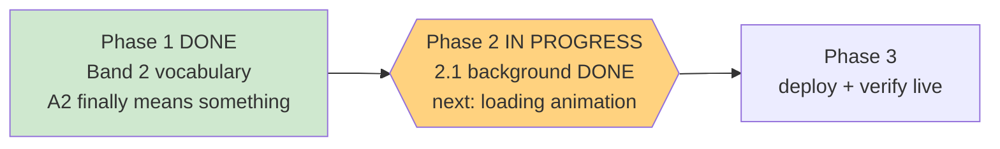

# STATUS — band2-and-polish

*Rewritten in full at every update. Last update: Phase 2 in progress — step 2.1 accepted.*

## Where we are

Phase 1 (the difficulty fix) is done. Phase 2 (the visual work) has started. **Still not deployed**
— that's Phase 3, so everything ships in one go.

## Something I need to tell you: the app had an accessibility bug, and it was invisible

While planning the background work, a fresh agent found this — nobody had recorded it, and it was
already live:

The page background was painted with a **hard-coded colour** rather than one of the named design
tokens. The contrast checker only ever looks at the named tokens, so it never measured the actual
background. On that surface, the **border colour used on buttons and answer options measured
2.92:1**, where the app's own frozen design rules require **at least 3:1**. The checker has been
happily reporting "ALL PASS" over a surface that quietly failed.

It's fixed. The background is now built entirely from named tokens, the failing colour is at
**3.10:1**, and the checker now measures **52 colour pairs instead of 28** — every layer of the new
background included. I also added a test so the checker actually runs as part of `npm test`; until
now nothing ran it automatically, so this could have drifted again without anyone noticing.

To be clear about what changed visually: the top of the background got about 20% darker. That is
what buys the legal contrast margin, and it is not something you'd notice side by side.

## What the background looks like now

Four layers instead of one flat wash: a warm brown top fading into the page colour, plus three soft
glows — violet at the top left, teal at the top right, and an amber lantern glow rising from the
bottom. All three are pulled from the artwork's own palette.

They are deliberately restrained. Each glow is capped by the 3:1 border rule above, which limits it
to roughly a 9% tint. **If you want them bolder, that's a decision for you**, and the honest options
are (a) lighten the border colour, which is a frozen value, or (b) accept a contrast regression.
I won't quietly do either one.

## How hard I checked

The safety argument was "every blended pixel sits between the layer colours, so checking the four
layers is enough." That's reasoning, not measurement, so I measured: **14,641 real blends** of all
four layers at every opacity. Worst border contrast came out at **3.0618** — above the 3:1 line —
and the worst case landed exactly on one of the four colours the checker tests. So the check isn't
merely adequate; it's exactly tight.

**154 tests pass, 0 fail** (151 + 3 new).

## What's next in this phase

1. **Loading animation** — the plain grey spinning ring becomes a violet→teal→amber magic ring with
   a floating creature above it. Next up.
2. **Service worker cache bump** — so your phone actually fetches the new look instead of the
   cached old one.
3. **Documentation** — record all of this in the frozen design doc, including the contrast bug.
4. **The app icon** — see below.

## The app icon needs you

Two things you should know:

- The paw-print icon **cannot simply be replaced** — it's frozen by two tests and by the design
  doc's own "untouchable" list. So the artwork will be **added alongside** it as the icon your
  phone actually uses for the home screen. Same outcome, nothing broken.
- Your own rule says every new piece of artwork gets your approval before it goes in. I'll generate
  the girl-and-dragon icon and show you previews at 48, 96 and 192 pixels. **If you don't approve
  it, the phase finishes cleanly with the paw print** — exactly the caveat you already accepted.

One unknown I can't answer from here: if the app is already installed on her phone, Android often
refreshes the icon only when the app is removed and re-added.

## One thing still not fixed (deliberately)

The placement test still can't tell "comfortably at the ceiling" from "far past it" — every question
is elementary, so a strong reader just lands on A2. Fixing that needs harder questions, which means
new audio and artwork **and** a change to a frozen test contract. Written up as deferred, awaiting
your call.
