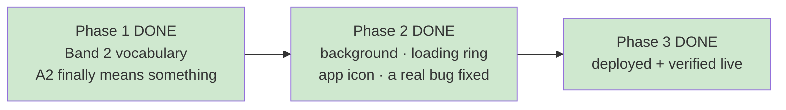

# STATUS — band2-and-polish

*Rewritten in full at every update. Last update: the run is finished and everything is live.*

## Where we are

**Done and live** at **https://english-app-three-tan.vercel.app**, verified from outside.

## What changed for her

- **The placement test finally does something.** Before this run, scoring 100% and scoring 60% gave
  her *the same stories* — both unlocked the same word list, so acing the test changed nothing. The
  top level now opens a second official Ministry of Education list (junior-high, 2,016 entries,
  extracted from the real PDF by a script — never invented by an AI). Ceiling: 1,257 → 2,850 words.
- **A richer background** — a warm brown top wash plus three soft glows from the artwork's palette:
  violet top-left, teal top-right, amber rising from the bottom.
- **A themed loading animation** — the grey ring is now a violet→teal→amber magic ring with the
  dragon floating above it. Both animations damp down for "reduce motion".
- **The girl-and-dragon app icon** you approved. The paw print couldn't be deleted (frozen by two
  tests), so the artwork was added *alongside* it and owns the home-screen slot.

## A real accessibility bug — and it was already live

Not something I introduced. The background was painted with a **hard-coded colour** instead of a
named token, and your contrast checker only looks at named tokens — so it never measured the actual
background. On that surface the **border on buttons and answer options was 2.92:1**, where your own
frozen rules require **3:1**. The checker printed "ALL PASS" over a surface that failed.

Fixed: that border is now **3.10:1**, the checker measures **52 pairs instead of 28**, and it now
runs inside `npm test` — it had never run automatically, so accessibility could regress silently.

Cost: the top of the background is ~20% darker, and the glows are subtle, because each is capped by
that same 3:1 rule. **Bolder is your call** — the honest options are lightening the border colour (a
frozen value) or accepting a contrast regression. I won't quietly do either.

## Four things to know, none of them broken

1. **Her icon may not change by itself.** If the app is already installed, Android often refreshes an
   icon only on remove-and-re-add. Old paw print ≠ failed deploy. This is now written into
   `docs/owner-handoff.md` in Hebrew, for when you're standing at the phone. (The browser *tab* icon
   stays a paw print permanently — frozen by a test.)
2. **I don't know whether this reaches her yet.** Her level lives in her profile, which I'm not
   allowed to read. If she placed at A1, nothing changes for her until she re-takes the test. You
   can check; I deliberately can't.
3. **Top-level stories cost slightly more.** The word list is sent with every request and grew from
   ~9,000 to ~23,700 characters — well under a cent per chapter, invisible against your $5–10/month
   ceiling, but you'd otherwise only find it on the OpenAI dashboard.
4. **No story has been generated at the new level yet** — that costs an OpenAI call and writes her
   profile, and nothing authorised either for a test. Why I'm comfortable: the check that rejects
   too-hard chapters counts *known* words, and a bigger list can only push that number up.

## How hard I checked

- 157 tests pass, 0 fail. Contrast: 52 pairs, all pass.
- **The live site was compared byte-for-byte to the code** — nine files (service worker, styles, app,
  reader, manifest, all four icons) have identical fingerprints on the server and on disk.
- **Proved the new vocabulary file reached the server, for free** — a deliberately rejected request
  comes back cleanly, which is only possible if the whole module, including the 2,016-word file,
  loaded. A broken file would have thrown a server error.
- **Her profile was never touched**, checked three ways: no command in this phase even contains the
  profile address, the storage code is unchanged since before the run, and her data folder is empty.
- **A way back was written down before I deployed, not after.** One command, code-only, no data
  migration. In five previous runs, nobody had ever recorded how to undo a deployment here.

## Still open — all four need your call

- **The placement test still can't tell "at the ceiling" from "far past it."** Every question is
  elementary. Fixing it needs harder items: new audio and artwork, plus a frozen-test change.
- **The test count is hand-written into two documents**, so it will drift again. Fix is to state it
  once or not at all — a style call.
- **`bash.exe.stackdump`**, junk committed at the repo root (not by this run), ships on every deploy.
  One command to remove, but removing a file nobody asked me to touch isn't mine to decide.
- **The entry code protecting your API isn't in the frozen design doc.** Live and working, but added
  outside any planned run. That document needs your approval to change, so I recorded the gap.
