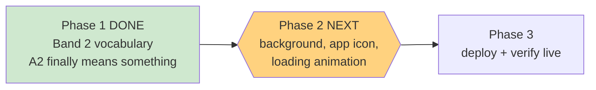

# STATUS — band2-and-polish

*Rewritten in full at every update. Last update: Phase 1 done — paused at the phase boundary.*

## Where we are

The difficulty ceiling is fixed in the code. **Not deployed yet** — that comes after the visual
work, so it all ships in one go.

## What was actually wrong, and what changed

The test graded her `preA1`, `A1` or `A2` — but `A1` and `A2` unlocked **exactly the same words**.
Scoring 100% and scoring 60% produced identical stories. Acing it gained her nothing.

Now:

| Grade | Words the story can use | Before | After |
|---|---|---|---|
| preA1 | starter list | 296 | 296 |
| A1 | full elementary list | 1257 | 1257 |
| **A2** | elementary **+ junior high** | 1257 | **2850** |

So doing well on the test now genuinely earns her harder stories — 1593 extra words like *abroad,
accept, achieve, adequate, admire, advantage*.

## Where the vocabulary came from

Not invented. It's the Israeli Ministry of Education's official **"Lexical Band II — Junior High
School"** list, the sequel to the elementary list the app already used, pulled from the same
government source and extracted by a script that's committed to the repo. 2016 entries.

I checked the extracted words themselves, not just that the file looked right — this is her
schooling, so "well-formed" isn't good enough. Three entries looked like they might be junk from
the page headers; all three turned out to be real vocabulary (*state* correctly appears three
times, as "say", "condition" and "country" — exactly how a dictionary lists them).

## Checks

- **151 tests pass, 0 fail.** The count rose from 146 because I added five new ones that guard the
  new vocabulary file, so a bad rebuild can never ship silently.
- Running the extractor twice produces byte-identical output.
- Her stored profile was never touched — nothing in this phase talks to the server at all.

## Next: the visual work

Background art, the girl-and-dragon home-screen icon, and a themed loading animation instead of
the plain spinning ring.

**I'd suggest starting that in a fresh session.** This one has been going a long time and my
working memory is quite full; the plan and journal are written so a clean session picks up exactly
where this left off with nothing lost. Everything needed is in
`.oplan/band2-and-polish/`.

## One thing still not fixed (deliberately)

The test still can't tell "comfortably at the ceiling" from "far past it" — every question is
elementary, so a strong reader just lands on A2. Fixing that means new, harder questions, which
needs new audio and artwork **and** changes a frozen test contract. It's written up in the plan as
deferred, awaiting your call.
