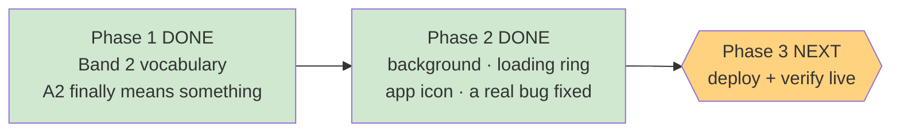

# STATUS — band2-and-polish

*Rewritten in full at every update. Last update: Phase 2 closed — paused before deployment.*

## Where we are

Both the difficulty fix and the visual work are **done and committed**. Nothing is live yet —
deployment is Phase 3, so it all ships in one go.

## The thing worth telling you first: a real accessibility bug, and it was live

Not something I introduced — something already shipped, that nobody had spotted.

The page background was painted with a **hard-coded colour** instead of one of the named design
tokens. Your contrast checker only ever looks at named tokens, so it never measured the actual
background at all. On that surface the **border colour used on buttons and answer options came out
at 2.92:1**, where your own frozen design rules require **at least 3:1**. The checker was reporting
"ALL PASS" over a surface that failed.

Fixed. The background is now built entirely from named tokens, that border is at **3.10:1**, and the
checker measures **52 colour pairs instead of 28**. I also made the checker run as part of
`npm test` — it had never run automatically before, so accessibility could have quietly regressed
between sessions and nothing would have said a word.

The only visible cost: the top of the background is about 20% darker. That darkening *is* what buys
the legal margin.

## What she'll actually see

**A richer background.** Four layers instead of one flat wash: a warm brown top fading into the page
colour, plus three soft glows from the artwork's palette — violet top-left, teal top-right, and an
amber lantern glow rising from the bottom.

They are deliberately restrained, because each glow is capped by that same 3:1 border rule (roughly
a 9% tint). **If you want them bolder, that's your call** — the honest options are lightening the
border colour (a frozen value) or accepting a contrast regression. I won't quietly do either.

**A themed loading animation.** The plain grey spinning ring is now a violet→teal→amber magic ring
with the little dragon floating above it while the story generates. Both animations stop or slow
down for anyone who has "reduce motion" switched on.

**The girl-and-dragon app icon**, which you approved. One thing to know: the paw print could **not**
be deleted — it's frozen by two tests and by the design doc's own untouchable list. So the artwork
was *added alongside* it and now owns the home-screen slot, while the paw print stays as a fallback.
Same result on her phone, nothing broken.

## How hard I checked

- **157 tests pass, 0 fail** (151 at the start of this phase; the 6 new ones guard the background
  and the icons).
- The background's safety argument was "every blended pixel sits between the layer colours." That's
  reasoning, not measurement — so I measured: **14,641 real blends**. Worst border contrast
  **3.0618**, and the worst case landed exactly on one of the four colours the checker tests. The
  check isn't just adequate, it's exactly tight.
- Verified in a real browser from the DOM, not from a screenshot — including proving the ring
  genuinely rotates by driving the animation clock, because Chrome freezes animations in a
  background tab and it *looked* frozen.
- **Her profile was never touched.** The only server I ran was local, pointed at a scratch folder,
  and I confirmed afterwards that the real data folder was still empty. Worth knowing: simply
  loading the app creates a profile, so this isn't a theoretical precaution.

## Two things I got wrong, and what caught them

Both were caught by the checking machinery rather than by me, which is the point of it:

- I wrote a validation check for the icon padding that **could never pass** — it used a sharp call
  that silently ignores the crop and measures the whole image. The worker stopped and asked instead
  of "fixing" the padding colour to make my broken check go green. That would have shipped a wrong
  icon with a passing gate.
- The reviewer caught that the new icon's entry in the design doc was missing a marker that every
  other entry carries — the marker recording that the house art style was applied. Left alone, the
  document would have implied the icon was made without it. A grep can't catch a fluent sentence
  that's false.

## Next: Phase 3, deploy

Push to Vercel, verify the live site with read-only checks, and confirm her profile was never
contacted. **I'd suggest a fresh session for it** — this one is long and my working memory is full.
Everything needed is written down in `.oplan/band2-and-polish/`.

One thing I can't determine from here: if the app is already installed on her phone, Android often
refreshes an icon only when the app is removed and re-added. The new icon may not appear on its own.

## Still not fixed (deliberately)

The placement test still can't tell "comfortably at the ceiling" from "far past it" — every question
is elementary, so a strong reader just lands on A2. Fixing it needs harder questions, which means
new audio and artwork **and** a change to a frozen test contract. Written up as deferred, awaiting
your call.
