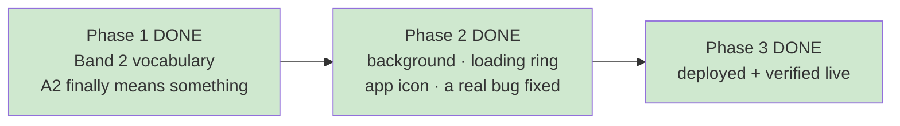

# STATUS — band2-and-polish

*Rewritten in full at every update. Last update: the run is finished and everything is live.*

## Where we are

**Done and live.** Both things you asked for — the difficulty ceiling and more of the artwork in
the app — are deployed at **https://english-app-three-tan.vercel.app** and verified from outside.

## What actually changed for her

**The placement test finally does something.** Before this run, scoring 100% and scoring 60% gave
her *exactly the same stories* — both levels unlocked the same word list, so acing the test changed
nothing. Now the top level opens a second official vocabulary list from the Ministry of Education
(junior-high level, 2,016 entries, extracted from the real PDF by a script — never invented by an
AI). Her vocabulary ceiling went from 1,257 words to 2,850.

**A richer background.** Four layers instead of one flat wash: a warm brown top fading into the page
colour, plus three soft glows from the artwork's palette — violet top-left, teal top-right, and an
amber lantern glow rising from the bottom. Deliberately restrained, for the reason below.

**A themed loading animation.** The plain grey spinning ring is now a violet→teal→amber magic ring
with the little dragon floating above it while the story generates. Both animations stop or slow
down for anyone who has "reduce motion" switched on.

**The girl-and-dragon app icon** you approved. The paw print could not be deleted — it's frozen by
two tests and by the design doc's own untouchable list — so the artwork was *added alongside* it and
now owns the home-screen slot. Same result on her phone.

## The thing worth telling you first: a real accessibility bug, and it was live

Not something I introduced — something already shipped, that nobody had spotted.

The page background was painted with a **hard-coded colour** instead of a named design token. Your
contrast checker only ever looks at named tokens, so it never measured the actual background at all.
On that surface the **border colour used on buttons and answer options came out at 2.92:1**, where
your own frozen design rules require **at least 3:1**. The checker was reporting "ALL PASS" over a
surface that failed.

Fixed. That border is now at **3.10:1**, the checker measures **52 colour pairs instead of 28**, and
it now runs as part of `npm test` — it had never run automatically before, so accessibility could
have quietly regressed between sessions and nothing would have said a word.

The only visible cost: the top of the background is about 20% darker. That darkening *is* what buys
the legal margin. And the glows are subtle because each one is capped by that same 3:1 rule. **If
you want them bolder, that's your call** — the honest options are lightening the border colour (a
frozen value) or accepting a contrast regression. I won't quietly do either.

## Four things you should know, none of them broken

1. **Her app icon may not change by itself.** If the app is already installed on her phone, Android
   often refreshes an icon only when the app is removed and re-added. If you see the old paw print,
   that's this — not a failed deploy. I've written this into `docs/owner-handoff.md` in Hebrew so
   it's there when you're standing at the phone. (The browser *tab* icon is still the paw print
   permanently — that one is frozen by a test and couldn't be replaced.)
2. **I don't know whether any of this reaches her yet**, because her level is stored in her profile
   and I'm not allowed to read it. If she placed at A1, the new vocabulary changes nothing for her
   until she re-takes the placement test. You can check; I deliberately can't.
3. **Stories at the top level now cost slightly more.** The word list is sent to the AI with every
   request, and it grew from about 9,000 characters to 23,700. That's well under a cent per chapter
   and invisible against your $5–10/month ceiling — but it's a real change and you'd otherwise only
   find it on the OpenAI dashboard.
4. **No story has actually been generated at the new level yet.** Doing so costs an OpenAI call and
   writes to her profile, and nothing in the plan authorised either for a test. The reason I'm
   comfortable: the check that rejects too-hard chapters measures *how many words are known*, and a
   bigger word list can only make that number go up. It can't cause new failures. But the first real
   A2 chapter will be one she reads, not one I read.

## How hard I checked

- **157 tests pass, 0 fail.** Contrast checker: 52 pairs, all pass.
- **The live site was compared byte-for-byte against the code.** Nine files — the service worker,
  styles, app code, the reader, the manifest and all four icons — are identical fingerprints on the
  server and on disk. Not "it loaded fine": identical.
- **Proved the new vocabulary file actually reached the server, for free.** Sending a deliberately
  rejected request to the story endpoint gets a clean "not authorised" back — which is only possible
  if the whole module, including the 2,016-word file, loaded successfully. A broken file would have
  produced a server error instead.
- **Her profile was never touched.** Checked three ways: no command in this phase even contains the
  profile address, the storage code hasn't changed since before the run, and her data folder is
  empty. Worth knowing: simply *loading* the app creates a profile, so this isn't theoretical.
- **A way back was written down before I deployed, not after.** Rolling back is one command, and it
  is code-only — no data migration, nothing that could leave her profile inconsistent. In five
  previous runs on this project, nobody had ever written down how to undo a deployment.

## Two things I got wrong, and what caught them

- I wrote a validation check for the icon padding that **could never pass** — it used an image
  library call that silently ignores the crop and measures the whole picture. The worker stopped and
  asked instead of "fixing" the padding colour to make my broken check go green. That would have
  shipped a wrong icon with a passing gate.
- The reviewer caught that the new icon's entry in the design doc was missing a marker every other
  entry carries — the one recording that the house art style was applied. Left alone, the document
  would have implied the icon was made without it. A grep can't catch a fluent sentence that's false.

## Still open, deliberately — all four need your call

- **The placement test still can't tell "comfortably at the ceiling" from "far past it."** Every
  question is elementary, so a strong reader just lands on the top band. Fixing it needs harder
  questions — new audio and artwork, plus a change to a frozen test contract.
- **The test count is written into two documents by hand**, so it will drift again the next time a
  test is added. The fix is to state it in one place or stop stating it; that's a style call.
- **`bash.exe.stackdump`** is a junk file committed at the repo root (not by this run) that gets
  uploaded on every deploy. Harmless, one command to remove — but removing a file nobody asked me to
  touch isn't mine to decide.
- **The entry code protecting your API isn't in the frozen design doc.** It's live and working, but
  it was added outside any planned run and `design.md` doesn't mention it. That document needs your
  approval to change, so I recorded the gap instead of editing it.
