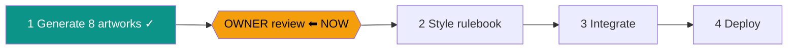

# STATUS — run "delight-pass" (visual design pass)

**Updated:** 2026-07-24 · **Where we are:** ✅ Phase 1 done — **waiting for YOUR asset review.**

All 8 artworks are generated and machine-validated, in `assets/delight/`:
hero-clinic (cottage exterior) · chapter-clinic / chapter-forest / chapter-night (story
banners) · heroine (girl + dragon) · placement-friend (purple mascot) · celebration ·
words-treasure (gem jar). Style matches the approved dragon-clinic test image; character
consistency holds across images.

## What you need to do
Open `assets/delight/` and look at the 8 images. Then either approve, or name the ones to
redo (and what bothers you) — redos re-run through the same pipeline.

## Notable events this phase (details in journal.md)
- One incident before step 1.1 acceptance: repeated Download clicks created 89 identical
  copies in your Downloads. Audited, root-caused, protocol + validation hardened (click-once
  rule, content-hash distinctness). A smaller 17-copy recurrence in 1.2 was caught by the
  hardened machinery. All duplicates deleted (each md5-verified first); your Downloads has
  no leftovers from this run.
- The 1.2 executor twice mis-clicked ChatGPT's "Share conversation" — it reports both share
  links deleted (Settings → Data controls → Shared links). Chat contains only cartoon
  prompts. You may want to double-check that list.

## After your approval
Phase 2 writes `docs/visual-design.md` (binding style rules + asset usage map), Phase 3
integrates everything with all 146 tests green, Phase 4 deploys to
https://english-app-three-tan.vercel.app.
