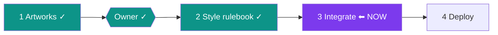

# STATUS — run "delight-pass" (visual design pass)

**Updated:** 2026-07-24 · **Where we are:** Phases 1–2 done. Planning Phase 3 (integration).

You approved all 8 artworks. The style rulebook now exists: `docs/visual-design.md` (frozen —
palette↔artwork map, typography, spacing, the full asset library with usage map and the exact
regeneration prompts, the image pipeline, do/don'ts). design.md §7 links to it.

## What happens next (no action needed from you)
Phase 3 wires the artwork and polish into the app: compressed mobile-friendly copies of the
images, home/placement/reader/words screens get the art (story chapters rotate 3 scene
banners), plus refined styling — with zero behavior changes. All 146 tests must stay green
after every step. Then Phase 4 deploys to https://english-app-three-tan.vercel.app and
verifies live.

## Invariants being enforced
Service worker untouched · palette tokens unchanged · no Hebrew copy edits · no logic edits ·
146/146 tests green.
