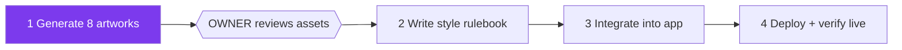

# STATUS — run "delight-pass" (visual design pass)

**Updated:** 2026-07-24 · **Where we are:** Phase 1 planned — generating the artwork next.

The app is live and working (see `.oplan/first-build/`). This run makes it *beautiful*:
real cartoon artwork in the style of the approved dragon-clinic test image, a written style
rulebook, and a polished UI — with zero behavior changes (all 146 tests must stay green).

## What happens next
1. Two worker agents drive Chrome → the dedicated ChatGPT chat and generate 8 images
   (clinic, heroine, placement mascot, celebration, word-treasure, 3 chapter banners).
2. **You review them** in `assets/delight/` — approve or ask for redos. Nothing is integrated
   before your OK.
3. Then: style doc → integration (tests stay green) → Vercel deploy.

## Rules this run cannot break
- The service worker + its precache list: untouched (frozen by tests).
- App colors stay the existing violet/teal/amber/cream palette (frozen by tests).
- No Hebrew copy changes, no logic changes — visuals only.
