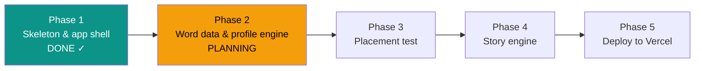

# STATUS — English learning app, run "first-build"

**Updated:** 2026-07-24 13:35 · **Where we are:** Phase 1 CLOSED ✓ — planning Phase 2 of 5.

## What's happening right now
**Phase 1 is done.** The app skeleton exists and runs on this machine: Hebrew RTL PWA with all
four screens (home, placement, story, word collection), design system, offline support, profile
storage, first API endpoints, local dev server — 35 tests green, every step audited and
committed. A fresh planner (Opus) is now planning Phase 2 — the official word list + the
profile engine — from the written record alone.

## The road

## Try it yourself (optional)
`npm run dev` in the project folder → http://localhost:3000 — you can click through the
shell on your phone-sized browser window. Screens are real; logic arrives in Phases 2–4.

## Decisions locked so far (the big ones)
- No build tools: plain HTML/CSS/JS PWA in `public/`, Vercel serverless functions in `api/`.
- Her profile = one JSON document; Vercel Blob in production, local file in development.
- App name: **"מרפאת הקסמים"** — purple/teal/amber look, Rubik font, Hebrew RTL UI.
- Tap-to-translate served from a per-chapter Hebrew glossary (instant, no per-tap AI call).

## Phase 1 numbers
5 steps, 0 escalations, 4 orchestrator interventions, ~558k subagent tokens
(workers 281k / checkers 277k). Auditors caught 2 real defects before they landed.

## Needs the owner (not blocking yet)
- Phase 3 will produce the placement item bank — you review it (~30 min) before she uses it.

## Risks being watched
- Extracting the official word list from the MoE PDF (Phase 2, next) — layout may fight us.
- Profile stored on a public-URL Blob (no real name in it; revisiting in Phase 5).
