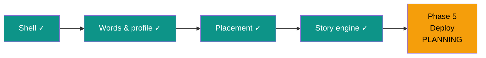

# STATUS — English learning app, run "first-build"

**Updated:** 2026-07-24 21:15 · **Where we are:** Phase 4 CLOSED ✓ — planning Phase 5 (deploy), the last one.

## What's happening right now
**The story engine is alive.** I generated a real chapter with the real OpenAI key and read it
in a real browser: "Luna and Sparkle" — 74 words, 97.3% within her allowed vocabulary,
Hebrew glossary for every new word, 3 comprehension questions (wrong answers let her retry;
right answers unlock the next chapter), ending on a cliffhanger. Word collection fills up as
she taps. 146 tests green. A fresh planner is planning Phase 5: deploy to Vercel.

## The road

## What the live test taught us (design decisions made at the gate)
- Her chosen hero/pet names are always "known" words (they were breaking the vocabulary check).
- The starting vocabulary is **band-aware**: a measured A1/A2 placement unlocks the school's
  full Band I list as the assumed floor; Pre-A1 keeps only the smaller pre-band list. Placement
  is the prior — exactly what design §3 intended.
- If the model forgets to translate a new word, the server now fills in that glossary entry
  itself — every unknown word is always tappable. The ≥95% readability gate is unchanged, and
  an unverifiable chapter is never shown (she sees a friendly "the magic is delayed" retry).

## ⚠ Needs the owner
- **docs/item-bank-review.md** — review before she takes the placement test (~30 min).
- On first real use: tap a word in the story yourself once to see the translation popup
  (automation couldn't physically tap word spans; the code path is tested and audited).

## Totals so far
21 steps · 0 escalations · ~3.0M subagent tokens · every step audited & committed.
