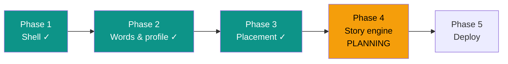

# STATUS — English learning app, run "first-build"

**Updated:** 2026-07-24 16:50 · **Where we are:** Phase 3 CLOSED ✓ — planning Phase 4 of 5.

## What's happening right now
**The placement test is built and works.** I clicked through it in a real browser: Hebrew
intro → listen-and-pick-the-picture items with real TTS audio → picture-to-word items →
two reading texts with Hebrew questions → deterministic scoring that writes her starting
level and marks measured words as known. 88 tests green. A fresh planner is now planning
Phase 4 — the story engine, the heart of the app.

## The road

## ⚠ Needs the owner — IMPORTANT
**`docs/item-bank-review.md` — REQUIRED BEFORE SHE USES THE TEST (~30 min).** Every test
item, translation, emoji, audio clip and marked answer is laid out for your review with
checkboxes. Two known weak spots are flagged for you: item t1-06 (desk → 🧑‍💻, translation
says "שולחן") and t1-04 (fan → 🌀). This does not block the build — Phases 4–5 continue.

## Decisions locked so far (the big ones)
- Placement: 12 word items (6 with audio) + 2 reading texts, fixed sets, pausable, no
  right/wrong feedback during the test; answer keys never leave the server.
- Level bands from scores: <50% → Pre-A1, 50–79% → A1, ≥80% → A2 (heuristic; you can
  recalibrate in the review doc).
- Only correctly-answered placement words are marked "known" — nothing is assumed.

## Phase totals so far
14 steps · 0 escalations · ~2.1M subagent tokens · every step audited & committed.

## Risks being watched
- Story generation keeping to ≥95% known words (Phase 4, next — the core constraint).
- Profile on a public-URL Blob (no real name stored; revisit in Phase 5).
