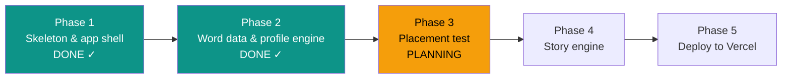

# STATUS — English learning app, run "first-build"

**Updated:** 2026-07-24 14:30 · **Where we are:** Phase 2 CLOSED ✓ — planning Phase 3 of 5.

## What's happening right now
**Phase 2 is done.** The app now has its learning brain: the official Ministry-of-Education
word list (1,341 entries extracted from the real MoE PDF), a coverage engine that can measure
what fraction of any English text she can read, and working tap-to-translate plumbing (tap a
word → saved as "learning"; placement/review can mark it "known"). 61 tests green. A fresh
planner is now planning Phase 3 — the placement test.

## The road

## Decisions locked so far (the big ones)
- No build tools; PWA + Vercel functions; profile = one JSON document (Blob in prod).
- App name **"מרפאת הקסמים"**; purple/teal/amber; Hebrew RTL UI.
- Word bank starts EMPTY — nothing is assumed known until measured (the founding-failure fix).
- Coverage counts only mastered ("known") words toward the 95–98% readability target.
- Heads-up discovered in planning: the MoE PDF has NO frequency data (design.md §3 implied it
  does) — item ordering in Phase 3 will use Pre-Band/Band + productive/receptive signals.

## Phase 1+2 numbers
9 steps, 0 escalations, 7 interventions (2 were real planner bugs the escalation rule caught
before any wrong code was written), ~997k subagent tokens total.

## Needs the owner (not blocking yet)
- Phase 3 produces the placement item bank — you review it (~30 min) before she uses it.

## Risks being watched
- Placement item pictures: likely emoji/inline-SVG at launch (decided in Phase 3 planning).
- Profile on a public-URL Blob (no real name stored; revisit in Phase 5).
