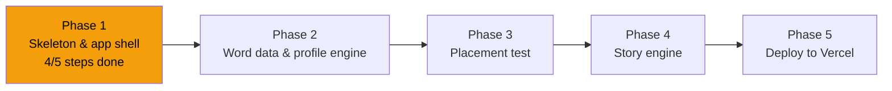

# STATUS — English learning app, run "first-build"

**Updated:** 2026-07-24 13:15 · **Where we are:** Phase 1 of 5, step 1.5 executing (4/5 accepted).

## What's happening right now
The app shell exists! Steps 1.1–1.4 are accepted: project scaffold, her profile/word-bank
storage, the first API endpoints, and the full Hebrew RTL PWA shell — home, placement, story
and word-collection screens, purple/teal/amber design, app icon, offline support. 29 tests
green. Step 1.5 — a local dev server so we can run the real app on this machine — is being
executed by a worker. It is the last step of Phase 1.

## The road

## Decisions locked so far (the big ones)
- No build tools: plain HTML/CSS/JS PWA in `public/`, Vercel serverless functions in `api/`.
- Her profile (words, skills, story progress) = one JSON document; Vercel Blob in production,
  local file in development.
- App name: **"מרפאת הקסמים"** — purple/teal/amber look, Rubik font, Hebrew RTL UI.
- Tap-to-translate works from a per-chapter Hebrew glossary generated with the chapter
  (instant, no per-tap AI call).
- Test runner: bare `node --test`; API bodies are strict JSON (empty body = error).

## Needs the owner (not blocking yet)
- Phase 3 will produce the placement item bank — you review it (~30 min) before she uses it.
- Nothing else right now; run is autonomous through all phases per your instruction.

## Risks being watched
- Extracting the official word list from the MoE PDF (Phase 2) — layout may fight us.
- Profile stored on a public-URL Blob (no real name in it; revisiting in Phase 5).
