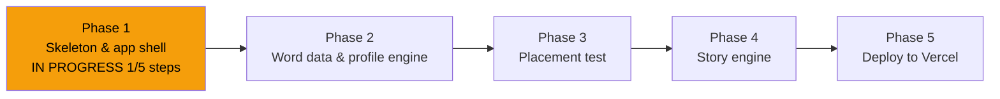

# STATUS — English learning app, run "first-build"

**Updated:** 2026-07-24 12:20 · **Where we are:** Phase 1 of 5, about to execute step 1.1.

## What's happening right now
Step 1.1 (project scaffold) accepted and committed. Step 1.2 (profile + storage libraries) is being dispatched.

## The road

## Decisions locked so far (the big ones)
- No build tools: plain HTML/CSS/JS PWA in `public/`, Vercel serverless functions in `api/`.
- Her profile (words, skills, story progress) = one JSON document; Vercel Blob in production,
  local file in development.
- App name: **"מרפאת הקסמים"** — purple/teal/amber look, Rubik font, Hebrew RTL UI.
- Tap-to-translate works from a per-chapter Hebrew glossary generated with the chapter
  (instant, no per-tap AI call).

## Needs the owner (not blocking yet)
- Phase 3 will produce the placement item bank — you review it (~30 min) before she uses it.
- Nothing else right now; run is autonomous through all phases per your instruction.

## Risks being watched
- Extracting the official word list from the MoE PDF (Phase 2) — layout may fight us.
- Profile stored on a public-URL Blob (no real name in it; revisiting in Phase 5).
