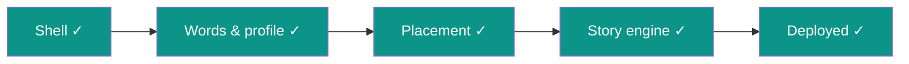

# STATUS — English learning app, run "first-build"

**Updated:** 2026-07-24 22:30 · **Where we are:** ✅ **RUN COMPLETE — all 5 phases. The app is live.**

## The app is deployed and verified
**https://english-app-three-tan.vercel.app**

The full loop was exercised on production: placement test → she names the heroine and her
magical animal → a real chapter generated live (97.8% of words within her allowed vocabulary,
Hebrew glossary for every new word, 3 comprehension questions, cliffhanger) → tap-to-translate
→ word collection → everything persisted in Vercel Blob. The test profile was then wiped —
she starts completely fresh. 146 tests green from a clean checkout.

## ⚠ Before she uses it — the owner's 3 steps (see docs/owner-handoff.md)
1. **Review `docs/item-bank-review.md`** (~30 min) — every placement item with checkboxes;
   two flagged weak items: t1-06 (desk → 🧑‍💻, "שולחן") and t1-04 (fan → 🌀).
2. **Tap one story word yourself** to see the translation popup (the one thing robot fingers
   couldn't physically test).
3. **Install on her phone**: open the URL in Chrome on Android → ⋮ → "Add to Home screen".
   Share only the canonical URL above (deployment-specific URLs redirect to a Vercel login).

## Where everything lives
- `docs/owner-handoff.md` — install, costs (~$5–10/mo), privacy posture, kill criteria.
- `.oplan/first-build/` — the complete run record: plan, journal (every step, every audit,
  every intervention), field guide, this file.
- Weekly-update features (spaced repetition, writing, recordings, trophies) were deliberately
  out of scope — design.md §6 lists them as the post-launch roadmap.

## Run numbers
5 phases · 26 accepted steps · 0 escalations (Sonnet handled every step) · 12 orchestrator
interventions (all logged) · ~2.78M subagent tokens · every step machine-validated, fresh-eyes
audited, and committed individually.
