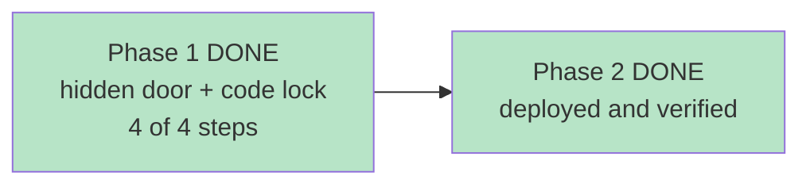

# STATUS — parent-access

*Rewritten in full at every update. Last update: built, deployed, verified. Run complete.*

## It's live

## How to open your screen now

**On the installed app:** press and hold the title **מרפאת הקסמים** on the home screen for about a
second and a half. The parent screen opens.

**In a browser:** `https://english-app-three-tan.vercel.app/#/parent` still works.

Either way it now asks for **the entry code** — the same one she types to get in — and it asks
**every single time**.

## What she sees

Nothing new. The home screen is byte-for-byte identical to before; I checked that mechanically
rather than by eye. No new button, no new tab, no label, nothing that hints the gesture exists.

## Before it works on her phone

The app has to pick up the update. Open it, close it fully, open it again. If the long-press does
nothing, the phone is still running the old cached version — the version marker went from `v8` to
`v9`, which is what forces the refresh.

## Honest limits

- **It's a lock on a phone, not a safe.** It stops whoever picks up an unlocked phone from reading
  her results. Someone with a computer and developer tools could get past it. The real secret — the
  API — is still locked server-side, as it always was.
- **The code is one she knows.** That was your call, and it's why this took one line instead of a
  new password system.
- **The parent screen needs internet.** It's loaded on demand and deliberately not stored offline
  (a rule from the frozen design doc I didn't quietly break). Offline you'll get a Hebrew message
  saying so.
- **The gesture can misfire in principle** — a stationary 1.5-second hold on the title with almost
  no finger movement. Unlikely in normal use, and any scroll or reposition cancels it.

## Verified, not assumed

Seven files on the live site are byte-identical to this repo, including `styles.css` — the whole
feature shipped with **zero CSS changes**, by reusing the entry-code screen's existing styling. The
live shell contains no trace of `#/parent`. 179 tests pass. The item bank's answers are still
unreachable from the internet.
