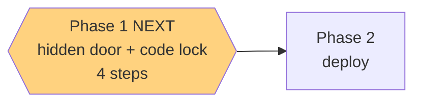

# STATUS — parent-access

*Rewritten in full at every update. Last update: planned and reviewed, nothing built yet.*

## What you asked for

You can't reach your own parent screen from the installed app — it opens fullscreen with no address
bar, so there's nowhere to type `#/parent`. And that screen has no lock on it at all.

## What I'm building

- **A hidden door.** Press and hold the title **מרפאת הקסמים** on the home screen for about a second
  and a half. Nothing on her screen changes — no button, no tab, no label. She won't find it by
  accident, and nothing about the app looks different to her.
- **A lock on the screen itself, not on the door.** Opening `#/parent` asks for the entry code —
  the same one she types to get into the app — *every* time. Typing the URL in a browser is now
  locked too, which it wasn't before.

## Three things you decided, so I don't guess later

1. Hidden gesture, not a visible link or a tab.
2. The password is the entry code you already have. No second password to remember or lose.
3. It asks every single time, not once per session.

## Honest limits

- **The lock is a lock on the phone, not a safe.** It stops whoever picks up an unlocked phone from
  reading her results. Someone determined, with a computer and developer tools, could get past it.
  The real secret — the API — stays locked server-side, as it already was.
- **You said you don't mind her reading it,** so the code being one she knows is by design.
- **The parent screen still needs internet** the first time you open it after an update. That's a
  rule from the frozen design doc that I'm not quietly breaking; you'll see a Hebrew message saying
  so if you're offline.

## What happens to her

Nothing. The home screen looks identical, no new tab, no new button. Her app is untouched apart
from a routine update prompt.
