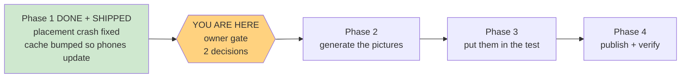

# STATUS — placement-fix-and-art

*Rewritten in full at every update. Last update: Phase 1 shipped; paused at the owner gate.*

## The bug is fixed and live

The placement test can now be completed. Deployed to production and verified there.

## What was wrong

The reading part of the test shows one story, then a second story. The code worked out *which*
story to show by asking "which story still has an unanswered question?" — so the instant you
answered the very last question, the answer was "none", and the code tried to draw a story that
didn't exist. It crashed. Your click was actually recorded; the screen just never redrew, which
is why it felt like the button was dead.

It was always going to happen on the last question of the last story — the elephant one. **This
predates all the colour work**; it came in with the original placement flow. It also means the
test has never once been completable, which is almost certainly why her profile still says
"placement not started".

The fix makes the app track which story it's on explicitly, instead of guessing from the answers.
A side benefit: the "ממשיכים" button now actually does the advancing. Before, the app silently
jumped to story two the moment you answered story one's third question.

## How we know it's really fixed

We built a test harness that loads the real app code and plays the whole test start to finish.
Run against the **old** code it crashes on the elephant question with the exact error above. Run
against the **new** code it plays through and reaches the "you finished!" screen. A regression
test that doesn't fail before the fix proves nothing, so we checked both directions.

All 146 tests still pass, and the service-worker cache was bumped to `magic-vet-v4` so her phone
actually downloads the fix instead of serving the old broken copy from memory.

**Her profile was never touched.** Everything was tested against an isolated local sandbox.

## Now: two decisions before we spend anything

### 1. The pictures

You were right, and it's worse than it looks. There are two kinds of question:

- **Hear a word, pick a picture** (6 items) — you pick from four emoji.
- **See a picture, pick the word** (6 items) — the emoji is the *only* clue; these have no audio
  at all.

So bad emoji hurt the second kind more. The worst offenders: "zoo" is shown as 🦁 a lion,
"fan" (מאוורר) is 🌀 a spiral, "desk" (שולחן) is 🧑‍💻 a person at a laptop, and "singer" is
🎤 a microphone. Twelve distinct pictures would cover the entire test.

### 2. A question that's unfair no matter how it's drawn

Item 1 asks for **pet** (חיית מחמד). The correct answer is a dog — but one of the wrong answers
is a **horse**. A horse is a pet. That item has two defensible answers, and a picture won't fix
it; only changing the wrong-answer option will. That's a content change, so it's your call.
