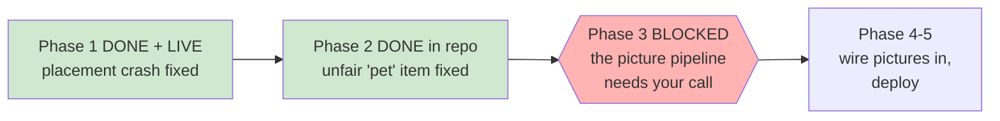

# STATUS — placement-fix-and-art

*Rewritten in full at every update. Last update: bug fixed and live; images blocked, waiting on you.*

## The important thing: the bug is fixed and live

The placement test can be completed now. It's deployed and verified on production. That was the
urgent part, and it's done.

## What shipped

**The crash fix — live now.** The reading test worked out which story to show by asking "which
story still has an unanswered question?", so the moment the last question was answered it tried
to show a story that didn't exist, and crashed. Fixed by tracking the current story explicitly.
Proven with a harness that plays the whole test start to finish: it crashes on the old code at the
elephant question and completes cleanly on the new code. All 146 tests pass, the cache was bumped
so returning phones fetch the fix, and it's verified on the live site.

**The unfair "pet" item — fixed in the code, not yet published.** The horse option (a horse is a
pet) is swapped for a tent/camp. It's committed and will go out with the pictures in one deploy
rather than two.

Her profile was never touched — everything ran against an isolated sandbox.

## Why the pictures are blocked

You chose to make the 12 pictures in your dedicated ChatGPT chat — the one that made the original
artwork — for the closest style match. **That chat won't load today.** It returns "content
unavailable," and on retry just spins forever without showing anything. A brand-new chat loads
fine and you're logged in, so ChatGPT itself is working — it's that specific old, image-heavy
chat that's stuck. My browser tools have also been glitchy this whole session, and generating 12
pictures one at a time through a flaky browser is exactly how the last run accidentally saved 89
duplicate files. So I stopped rather than risk a mess.

**Everything else for the pictures is ready.** I've written and frozen all 12 prompts (as clear
single-subject icons, since they show at thumbnail size), the download-and-shrink pipeline, and
the checks. The moment the method is unblocked, it runs.

## Your call (one question)

How do you want the 12 pictures made?

1. **Try the dedicated chat again later** — from a fresh session, once it loads. Best style match,
   but it's stuck right now and I can't tell when it'll recover.
2. **Use a new ChatGPT chat** — I re-upload the original style-reference image (it's saved locally)
   so the look still matches, and generate there. Sidesteps the stuck chat. This differs from "the
   one dedicated chat" you picked, so I'm asking rather than assuming.
3. **Switch to the scripted OpenAI method** — not browser-dependent at all, fully repeatable, about
   $0.25–$2.30 on your key. You'd earlier preferred the ChatGPT route for style; this trades a
   little style-continuity for reliability.

Nothing is spent and nothing is deployed until you pick. The crash — the thing that was actually
breaking for her — is already fixed and live.

## One thing to flag about the picture style

The options show at about thumbnail size on the buttons. A full detailed scene is unreadable that
small, so I wrote the prompts as single clear objects (a dog, a tent, a steak) in the same warm
cartoon look, rather than busy scenes. If you'd rather they be richer little scenes, say so and
I'll rewrite the prompts before generating.
