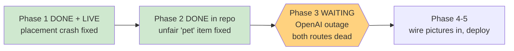

# STATUS — placement-fix-and-art

*Rewritten in full at every update. Last update: stopped after checks — OpenAI is down.*

## Bottom line

The bug that was actually hurting her is **fixed and live**. The pictures can't be made right now
because **OpenAI is having an outage** — not because of your account, and not because of the
method we picked.

## I gave you bad advice last message — retracting it

I told you the errors pointed at your OpenAI account and suggested you check billing. **That was
wrong. Don't go looking through billing.**

The login error you hit decodes to `primaryapi_server_error`, and OpenAI's status page shows an
active incident, "Elevated error rates", with about 22 services degraded — including **Login**,
**Images**, and **Sites**.

What misled me: I tested a deliberately fake API key and it got a clean rejection, so I assumed
their systems were healthy and the problem must be yours. But a fake key gets rejected instantly
at the front door, while a *real* key needs their main backend to look up the account — and that
backend is exactly what's broken. Both behaviours are explained by their outage. My test was fine;
the conclusion I drew from it wasn't.

## What I checked, and what it proved

- **The API route**: every endpoint — images, chat, even a simple model list — returns a server
  error with your key, through two different tools. Not this computer, not the network.
- **The web route** (the fallback you approved): ChatGPT loads and accepts the prompt, but after
  **four minutes** it produced no image and the sidebar couldn't even load your projects.

So both routes are blocked by the same incident. No choice of method gets around it — it's an
availability problem. Stopping and waiting is the right move, not retrying in a loop.

**Nothing was spent, nothing generated, nothing deployed.** The only trace is one throwaway
ChatGPT chat with a single prompt in it.

## Also worth knowing

`api/chapter.js` — the story generator — uses that same OpenAI key. So while this outage lasts,
**her story reader likely won't generate new chapters either**. That's their outage, not
something we broke, and it should clear on its own.

## Ready to go the moment it clears

- All 12 **rich scene** prompts are written and frozen (you asked for rich, not flat icons).
- The plan to enlarge the answer tiles so the rich art is actually visible: frozen.
- The download → shrink → verify pipeline, including a check that no two images are duplicates.
- Phase 3 will run as a proper oplan step — committed script, frozen validation, and a fresh-eyes
  audit — not ad-hoc.

Check https://status.openai.com/ ; when it's green, say the word and this picks up exactly where
it left off.

## Standing state

| Thing | State |
|---|---|
| Placement crash | **Fixed, deployed, verified live** |
| "pet" horse-vs-dog fairness fix | Committed, ships with the pictures |
| 12 rich pictures | Waiting on OpenAI |
| Her profile | Never touched, as promised |
