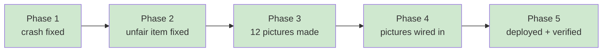

# STATUS — placement-fix-and-art

*Rewritten in full at every update. Last update: RUN CLOSED — everything live.*

## Done. All of it is live.

**https://english-app-three-tan.vercel.app**

## What she'll see now

**The test actually finishes.** It never could before — answering the last question crashed the
screen silently. That's fixed and was shipped first.

**Real pictures instead of emoji.** Twelve hand-generated scenes in the same warm world as the
rest of the app, on bigger tiles so they're properly visible. The three that were genuinely
unguessable are now obvious:

| Word | Was | Now |
|---|---|---|
| fan / מאוורר | 🌀 a spiral | a brass fan with blurred spinning blades and papers flying |
| desk / שולחן | 🧑‍💻 a person at a laptop | a wooden desk with a lamp, open book and quill — no person |
| zoo / גן חיות | 🦁 a lion | an entrance archway with a giraffe, lion and elephant |

**A fairer first question.** "Pet" used to offer a dog *and a horse* — a horse is a pet, so the
question had two defensible answers. The horse is now a tent.

## What it cost

**Nothing.** The pictures were made through your ChatGPT subscription in the browser, per your
rule about not paying the API for things that aren't generated live in the app. The paid route
would have been about $2.30. I've saved that preference so I default to it from now on.

## Checks that passed

- 146 of 146 tests green, unchanged throughout.
- Readability gate (WCAG AA) still passes.
- The 27 MB of full-size artwork ships as **166 KB** of optimised images.
- Every picture carries Hebrew alt text for screen readers.
- A runtime test drives the real app and confirms the pictures actually render and that tapping
  one still works — not just that the code looks right.
- Offline cache bumped, so her phone fetches the new version instead of the old one.

**Her profile was never touched.** Every interactive check ran against an isolated local copy.
That mattered more than usual here: simply opening the placement screen on the live site would
have created profile data, so I deliberately never did.

## Two things worth knowing

**The story reader depends on OpenAI.** Their outage earlier today broke it; it recovered while
we worked. If chapters ever fail to generate, check https://status.openai.com/ before assuming
the app is broken.

**One cosmetic thing left alone.** The "בואי נתחיל" button shows a link underline. It predates
all this work and isn't a colour or picture issue, so it stayed outside scope. One line to fix if
you want it.

## The record

`.oplan/placement-fix-and-art/` — plan, full journal, and lessons. Notably, the fresh-eyes review
caught that my own edit had deleted the twelve image prompts from the plan file, where they
existed nowhere else. That's the kind of thing the written record exists to catch.
