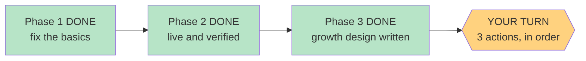

# STATUS — poc-basics

*Rewritten in full at every update. Last update: Phase 3 CLOSED — the run is done; three things are yours.*

## Where we are

**The app is live, and the run is finished.** Phase 1 built the fixes, Phase 2 deployed and verified
them, Phase 3 wrote the growth design. Nothing is left for me. Three things are left for you.

Her address: `https://english-app-three-tan.vercel.app`
Your private screen: `https://english-app-three-tan.vercel.app/#/parent`

## What I need from you

1. **Open the review tool and sign the gate** — double-click `docs/item-bank-review.html`, then record the sign-off in `docs/item-bank-review.md` section 6.
2. **Then give her the entry code** — the app sits behind the code you hold, so deploying does not put the test in front of her; only handing over the code does.
3. **Read and sign the growth design** — `docs/growth.md`. Signing section 10 is what authorizes the
   next run to build it. Nothing in it is built yet and nothing happens if you leave it unsigned.

Order matters for 1 and 2. Number 3 can wait until you have time; it is a proposal, not a fix.

## The thing worth reading in `docs/growth.md`

I found something while writing it, and it is the most important thing this run learned.

The design says the app keeps learning about her: every word she taps and every question she misses
should update her level. **It never did.** Tapped words are saved with the status "learning", and the
part that builds her story vocabulary only counts words marked "known" — and nothing in the app ever
marks a word "known". Her answers to the comprehension questions are written to a log that nothing
reads. So her level is decided once, by the 12-question placement test, and then never moves again.

That is not a bug I introduced and I have not changed it — changing it is exactly what `docs/growth.md`
proposes, and it is your call. It does mean the re-take button matters more than I thought when I
built it: today it is the *only* way her level can ever change.

One more number, corrected: the parent screen says her stories are built from 2850 words at level A2.
About 21% of those (596) can never actually be recognized — they are phrases and hyphenated entries
the word-matcher cannot see. The real figure is 2254. The screen is not lying, but it is optimistic.

## Still open — your call, unchanged

The placement test still can't tell "at the ceiling" from "far past it"; the test count is
hand-written into two docs; `bash.exe.stackdump` ships on every deploy; the entry code isn't in the
frozen design doc; a manual level override was left out; and the README still calls the app "in daily
use", which becomes true after action 2.

If something looks wrong on her device, the way back is recorded: roll back to
`english-msi6365hc-dkreinovs-projects.vercel.app`.
