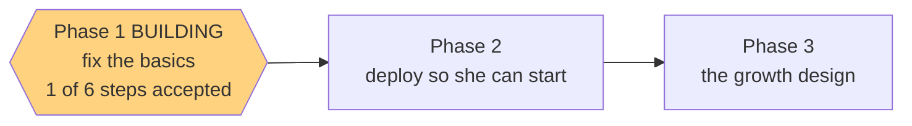

# STATUS — poc-basics

*Rewritten in full at every update. Last update: Phase 1 building — step 1 of 6 accepted.*

## Where we are

Phase 1 is being built, one step at a time. **Step 1 of 6 is done and committed.**

| Step | What it does | State |
|---|---|---|
| 1.1 | the placement test can be restarted | **accepted** |
| 1.2 | the parent-only `#/parent` screen + re-take button | next |
| 1.3 | the real entry-code screen | waiting |
| 1.4 | the service-worker cache bump | waiting |
| 1.5 | the item-bank review tool | waiting |
| 1.6 | the docs you actually read | waiting |

Tests: **159 passing, 0 failing** (was 157). Contrast gate: all 52 colour pairs pass.

## What Phase 1 will build

1. **A parent-only screen at `#/parent`** — her level and what it unlocks, both test scores, when
   she took it, and how many words she's collected. Deliberately not in the menu: telling an
   11-year-old "you are A1" is meaningless at best.
2. **A re-take button** on that screen. Re-taking overwrites the old result, so a bad placement
   stops being permanent. It's on your screen only — "redo the test" isn't a child's decision.
3. **A real entry-code screen** replacing the raw browser popup she'd hit first. Explains what the
   code is, says clearly when it's wrong, and lets her keep trying.
4. **A review tool for the item bank** — a page that plays every clip and shows every picture and
   its options, so the review you owe before her first test is a few minutes of tapping instead of
   30 minutes of opening mp3 files by hand.

## Why this is the fix

The core loop already works — it was verified end-to-end in production during the first build. The
real problem is that **her level is never shown anywhere in the app**, so a wrong placement isn't
just permanent, it's *invisible*: nobody can even know it happened. You can't make a 12-question
test precise; you make its verdict visible and correctable.

## Two decisions I made that you should know about

- **The item-bank review does not block the deploy.** Your design doc requires the review before
  *she sees the test* — not before the code is live. She can't reach the app without the entry code
  anyway, and you hold that. So we ship, then you review, then you give her the code.
- **`#/parent` goes into your handoff doc.** A route nobody can find delivers nothing.

## Still open — your call, unchanged from last run

The placement test still can't tell "at the ceiling" from "far past it"; the test count is
hand-written into two docs; `bash.exe.stackdump` ships on every deploy; and the entry code isn't in
the frozen design doc. All four are written up as deferred.
