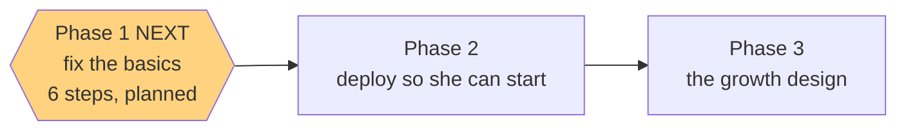

# STATUS — poc-basics

*Rewritten in full at every update. Last update: planned and reviewed, nothing built yet.*

## Where we are

The plan for "fix the basics" is written and has passed a fresh-eyes review. **No code has changed.**

## What I found before planning — the thing worth knowing

I went looking for what's broken and found that **nothing is**. The core loop was verified
end-to-end in production during the first build — placement, story generation, tap-to-translate,
micro-checks, word bank — and her profile was reset clean afterwards. So this isn't repair work.
It's about what stands between her and a good *first session*.

But the placement problem is worse than I told you earlier. It isn't just that a wrong level is
permanent. **The level is never shown anywhere in the app** — not to her, not to you. So a wrong
placement is *invisible*: nobody can even know it happened.

That changed the fix. You can't make a 12-question test precise; you make its verdict **visible and
correctable**. A harder exam would need new artwork, new audio, a frozen-test change and a level
above A2 to promote into — none of which helps her start this week.

## What Phase 1 will build

1. **A parent-only screen at `#/parent`** — her level and what it unlocks, both test scores, when
   she took it, and how many words she's collected. Deliberately not in the menu: telling an
   11-year-old "you are A1" is meaningless at best.
2. **A re-take button** on that screen. Re-taking overwrites the old result, so a bad placement
   stops being permanent. It's on your screen only — "redo the test" isn't a child's decision.
3. **A real entry-code screen** replacing the raw browser popup she'd hit first. Explains what the
   code is, says clearly when it's wrong, and lets her keep trying.
4. **A review tool for the item bank** — a page that plays every clip and shows every picture and
   its options, so the review you owe before her first test is a few minutes of tapping instead of
   30 minutes of opening mp3 files by hand.

## Two decisions I made that you should know about

- **The item-bank review does not block the deploy.** Your design doc requires the review before
  *she sees the test* — not before the code is live. She can't reach the app without the entry code
  anyway, and you hold that. So we ship, then you review, then you give her the code. That order is
  in the plan.
- **`#/parent` goes into your handoff doc.** A route nobody can find delivers nothing.

## How hard the plan was checked before any work started

A fresh reviewer attacked it and returned **fix-first** — it found a closing gate that could never
have passed (it asserted 5 changed files where the plan's own list has 6), a wrong number written
into a frozen acceptance criterion, and that one step only spot-checked the Hebrew it inserts
instead of every line. All three are fixed. That's the whole point of reviewing a plan before
building from it rather than discovering it halfway through.

## Still open — your call, unchanged from last run

The placement test still can't tell "at the ceiling" from "far past it"; the test count is
hand-written into two docs; `bash.exe.stackdump` ships on every deploy; and the entry code isn't in
the frozen design doc. All four are written up as deferred.
