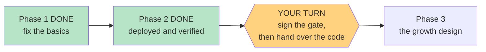

# STATUS — poc-basics

*Rewritten in full at every update. Last update: Phase 2 CLOSED — it is live.*

## Where we are

**The app is live.** Everything Phase 1 built is now on the real address, verified file by file
rather than assumed. Two things are left, and both are yours.

Her address: `https://english-app-three-tan.vercel.app`
Your private screen: `https://english-app-three-tan.vercel.app/#/parent`

## What I need from you

1. **Open the review tool and sign the gate** — double-click `docs/item-bank-review.html`, then record the sign-off in `docs/item-bank-review.md` section 6.
2. **Then give her the entry code** — the app sits behind the code you hold, so deploying does not put the test in front of her; only handing over the code does.

That order is the whole safety design. Until step 2, the deploy has changed nothing for her.

## What is live now

- **Your parent-only screen** at `#/parent` — her level, both placement scores, the date, her word
  count, and a **re-take** button. In no menu and no link, so she will not stumble into it.
- **A real entry-code screen** instead of the raw browser popup, with unlimited retries.
- **The review tool**, `docs/item-bank-review.html` — 6 recordings, 12 pictures, the answers marked.

## What I checked, rather than assumed

- Seven files are byte-identical between the live site and this repo — so the new screens really
  shipped, not "probably shipped".
- The entry-code lock is still closed on the live API. I tested the *rejection*, which costs nothing
  and never touches her data.
- **The review tool is not on the internet.** This one nearly fooled me: the first check came back
  "redirect" instead of "not found", which looked like the answers were being served. I tested a
  filename that definitely does not exist — it redirected too. The redirect is automatic and means
  nothing; every path ends in "not found". The answers are not reachable.
- I never opened her profile. Loading any page would have created one, so I only used checks that
  cannot touch it.

## Still open — your call, unchanged

The placement test still can't tell "at the ceiling" from "far past it"; the test count is
hand-written into two docs; `bash.exe.stackdump` ships on every deploy; the entry code isn't in the
frozen design doc; a manual level override was left out (re-taking already recovers); and the
README still calls the app "in daily use", which becomes true after step 2 above.

If something looks wrong on her device, the way back is recorded: roll back to
`english-msi6365hc-dkreinovs-projects.vercel.app`.
