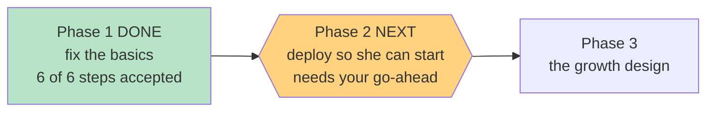

# STATUS — poc-basics

*Rewritten in full at every update. Last update: Phase 1 CLOSED — built, checked, not yet deployed.*

## Where we are

**Phase 1 is done.** All six steps are built, reviewed and committed. Nothing is live yet — the app
she would open today is still the old build. Phase 2 is the deploy, and it needs your go-ahead.

## What you now have (built, not yet live)

- **A parent-only screen.** Add `#/parent` to the app's address. It shows her vocabulary level and
  how many words her stories are built from, both placement scores, the date she took the test, and
  how many words she's collected. It is in no menu and no link — telling an 11-year-old "you are A1"
  is meaningless at best.
- **A re-take button on that screen.** The new result replaces the old one, so a wrong placement
  stops being permanent. It's on your screen only: "redo the test" isn't a child's decision.
- **A real entry-code screen** instead of the raw browser popup she'd have hit first. It explains
  what the code is and where to get it, says clearly when it's wrong, and lets her keep trying —
  the old one gave her exactly one retry and then a raw error string.
- **`docs/item-bank-review.html`** — double-click it. It plays all 6 recordings, shows all 12
  pictures with their options and the answer marked ✓, prints both reading texts with all 6
  questions, and has a checkbox per item with a "checked N of 18" counter.

Tests: **172 passing, 0 failing** (was 157). Colour-contrast gate: all 52 pairs pass.

## What I need from you

1. **Say go for the deploy** (Phase 2). It publishes the four things above. The rollback target gets
   recorded before the deploy, not after.
2. **Then open the review tool and sign the gate** in `docs/item-bank-review.md` §6.
3. **Then give her the entry code.** That order matters: the app sits behind the code you hold, so
   deploying does not put the test in front of her — only handing over the code does.

## Two things worth knowing

- I checked, with a script rather than by eye, that the answer marked ✓ in the review tool is the
  one the item bank actually calls correct — all 18 items and questions, zero mismatches. A tool
  that confidently marked the wrong answer would have passed every other test in the file.
- The review tool never ships to the internet. It holds the correct answers, so it lives outside the
  folder that gets deployed — and Phase 2 will prove that with a live 404 check.

## Still open — your call, unchanged

The placement test still can't tell "at the ceiling" from "far past it"; the test count is
hand-written into two docs; `bash.exe.stackdump` ships on every deploy; the entry code isn't in the
frozen design doc; and a manual level override for you was deliberately left out (re-taking already
recovers). All five are written up as deferred, not dropped.
