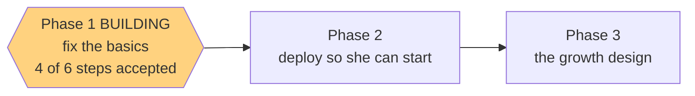

# STATUS — poc-basics

*Rewritten in full at every update. Last update: Phase 1 building — steps 1-4 of 6 accepted.*

## Where we are

Phase 1 is being built, one step at a time. **4 of 6 steps are done and committed.**

| Step | What it does | State |
|---|---|---|
| 1.1 | the placement test can be restarted | **accepted** |
| 1.2 | the parent-only `#/parent` screen + re-take button | **accepted** |
| 1.3 | the real entry-code screen | **accepted** |
| 1.4 | the service-worker cache bump | **accepted** |
| 1.5 | the item-bank review tool | next |
| 1.6 | the docs you actually read | waiting |

Tests: **168 passing, 0 failing** (was 157). Contrast gate: all 52 colour pairs pass.

One thing worth telling you: on step 1.2 the instructions I handed the builder were incomplete —
they named the frozen wording for the parent screen without including it. The builder found it
itself instead of stopping to ask and got it exactly right, but that was luck covering my mistake.
The review layer caught the hole, I checked the text character-by-character against the frozen copy
rather than by eye, and every later step now gets the full wording.

## What Phase 1 builds

The parent screen shows her level and what it unlocks, both test scores, when she took the test and
how many words she's collected — deliberately not in the menu, because telling an 11-year-old "you
are A1" is meaningless at best. Its re-take button overwrites the old result, so a bad placement
stops being permanent; it's on your screen only, since "redo the test" isn't a child's decision.
The entry-code screen replaces the raw browser popup she'd hit first. The review tool plays every
clip and shows every picture and its options, so the review you owe before her first test is a few
minutes of tapping instead of 30 minutes of opening mp3 files by hand.

## Why this is the fix

The core loop already works — verified end-to-end in production. The real problem: **her level is
never shown anywhere in the app**, so a wrong placement isn't just permanent, it's *invisible*. You
can't make a 12-question test precise — you make its verdict visible and correctable.

## Two decisions I made that you should know about

- **The item-bank review does not block the deploy.** Your doc requires it before *she sees the
  test*, not before the code is live. So we ship, you review, then you give her the code.
- **`#/parent` goes into your handoff doc.** A route nobody can find delivers nothing.

## Still open — your call, unchanged from last run

The placement test still can't tell "at the ceiling" from "far past it"; the test count is
hand-written into two docs; `bash.exe.stackdump` ships on every deploy; and the entry code isn't in
the frozen design doc. All four are written up as deferred.
