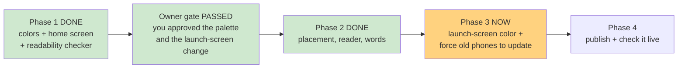

# STATUS — warm-dark-theme

*Rewritten in full at every update. Last update: Phase 2 closed, Phase 3 starting.*

## Where we are

Every screen in the app is now on the artwork's colors. Phases 1 and 2 are done and both passed
their gates. Still nothing published — this is all local.

## What Phase 2 changed

The three remaining screens — placement, the story reader, and the word collection. Answer
buttons, selected/correct/wrong states, the word popup, the badges, the loading spinner and the
input field all moved onto the new palette. Six files total have changed in the whole run so far,
and no test, no logic and no text among them.

## The thing Phase 2 caught that nobody had noticed

We hand each phase to a fresh planner who only reads the written record, partly as a way to test
that record. This time it found a genuine bug the rest of the machinery could not see.

Buttons in a web page do not inherit the page's text color — the browser supplies its own, which
is black. Three of the answer buttons never set a color of their own. On the old cream pages that
looked fine. On the new dark pages they would have been **black text on dark brown** — roughly
1.9 to 1, far below the readable minimum, on the buttons your daughter taps to answer questions.
Our automatic checker could not have caught it, because the offending color exists in no file at
all; it comes from the browser. Three lines were added to fix it.

## Readability, measured for real

Rather than eyeball a screenshot, we rendered all 25 themed states in a throwaway test page and
measured what the browser actually painted. **24 of 25 pass**, the weakest real one at 5.75
against a 4.5 minimum. The single exception is the greyed-out *disabled* button at 4.26, which
the accessibility standard explicitly exempts — it is meant to look unavailable.

That measurement caught a second problem, in itself: our first pass reported perfect scores for
the six tinted states because Chrome reports blended colors in a format our reader mis-parsed as
pure black. It was inventing passing numbers. Fixed, re-run, and written into the run's lessons.

## What's left

- **Phase 3**: the launch-screen and browser-bar colors you approved, plus telling returning
  phones to fetch the new version instead of serving the old one from their cache. That last part
  is the mistake the previous run learned the hard way.
- **Phase 4**: publish to Vercel and verify on the live site.

## Safety

Your daughter's profile has not been touched and will not be. Every check so far has used either
the static home screen or an offline test page — nothing has contacted the app's server, started
placement, or added a word.
