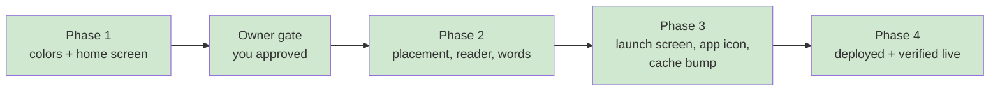

# STATUS — warm-dark-theme

*Rewritten in full at every update. Last update: RUN CLOSED, live on production.*

## Done. It's live.

**https://english-app-three-tan.vercel.app**

The whole app now sits on the colors of its own artwork. The pictures no longer look like dark
boxes glued onto a pale page — the page is the same world the pictures are painted in.

## What changed — 11 files, all of them colors

The stylesheet, the three screen stylesheets, the app icon, the page header, the app manifest,
the offline cache version, the frozen style document, one new checker script, and three lines in
one test that you personally approved.

**Not changed:** any logic, any Hebrew or English word, any layout, the right-to-left direction,
the artwork itself, or anything that can read or write your daughter's profile.

## Your constraints, one by one

| You asked for | Result |
|---|---|
| Colors from the artwork, not invented | Every color measured from the eight image files; the evidence is in the run's journal |
| No logic changes, no text changes | Proven mechanically — every changed line is a color/background/border/shadow line |
| All 146 tests stay green | 146 pass, 0 fail, at the deployed commit |
| Tell you before changing a test's color | Stopped and asked; you approved the three assertions that changed |
| WCAG AA, it's for a 6th-grader | A script checks 28 combinations on every change; measured 25 real rendered states in the browser too |
| Hebrew right-to-left unchanged | Unchanged and verified live |
| Never touch her profile | No API call was made at any point; nothing that reads or writes profiles changed |
| Bump the cache so old phones update | Done — and confirmed live that the new cache actually installed |

## Readability, measured rather than assumed

The live home screen was measured in a real browser: 8 of 8 text elements pass, weakest 7.42
against a 4.5 minimum. All 25 states across the other screens were measured the same way: 24 pass,
weakest 5.75. The one exception is the greyed-out disabled button at 4.26, which the standard
explicitly exempts because it is meant to look unavailable.

## Two things worth knowing

**The app icon.** Your launcher icon was still built entirely from the old cream and violet. It
wasn't in the plan — a worker refused to edit a file outside its instructions and asked instead.
The paw print now uses the new palette, exact same shape, and its background matches the browser
bar. If you'd rather keep the old icon, it's a four-line revert.

**One cosmetic thing we left alone.** The "בואי נתחיל" button shows a text underline, because it
is a link styled as a button. It looked that way before this work too, so it sat outside the
"colors only" boundary you set. Say the word and it's a one-line fix.

## Where the record lives

`.oplan/warm-dark-theme/` — the plan, the full journal with the color measurements and every
decision, the lessons file, and this status. `docs/visual-design.md` is the updated frozen style
contract, with the old cream values recorded as superseded so nobody reintroduces them.
