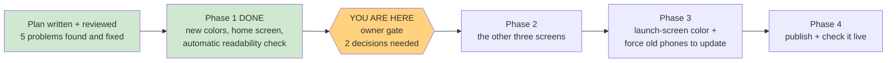

# STATUS — warm-dark-theme

*Rewritten in full at every update. Last update: Phase 1 finished — waiting at the owner gate.*

## Where we are

Phase 1 is done and passed its gate. The app's colors now come from the artwork, and the home
screen is fully re-themed. **Nothing has been published** — this is all local, on your machine.
The run is paused exactly where you asked it to pause.

## What changed, in three files

| File | What happened |
|---|---|
| `public/styles.css` | The whole app shell moved to the new colors, and the pictures now fade into the page instead of sitting in boxes |
| `scripts/check-contrast.mjs` | New. The automatic readability check — 28 text/background combinations, every time |
| `docs/visual-design.md` | The frozen style doc now records the new palette, where each color was measured from, and the old cream values marked as superseded |

Everything else is byte-for-byte untouched: no view file, no test, no logic, no text.

## Checks that passed

- **146 of 146 tests still green** — same as before we started, none rewritten.
- **Readability: all 28 combinations pass WCAG AA.** Weakest is 4.86 against a 4.5 minimum;
  ordinary page text sits at 16.0. We also deliberately broke a color to confirm the checker
  actually fails — it did, then passed again once restored.
- **No cream left** anywhere in the stylesheet.
- **Colors only**: a mechanical check proves every changed line in the stylesheet is a color,
  background, shadow, border or mask line. Nothing else moved.

## What we need from you

**1. Do you like it?** The two screenshots show the home screen. The pictures now bleed into the
page: the big banner fades out at its bottom edge, and the round character portrait has a soft
faded edge instead of a hard square. If the palette or that blending isn't right, this is the
cheap moment to change it — only one screen has been done.

**2. The launch-screen color.** There's a test that pins the app's startup background to the old
cream `#faf7f2` and the browser bar color to the old violet `#7c3aed`. That's what your phone
paints for a moment while the app opens. Leaving it means a white flash before the dark app
appears. Changing it means editing that test, which is a genuine contract change — so per your
instruction we stopped rather than quietly rewriting it. Our recommendation is startup
background → `#241305` and browser bar → `#2e1806`.

## One thing worth knowing (not a decision)

The primary button "בואי נתחיל" shows a text underline, because it's a link styled as a button.
That's how it was before this re-theme too — it isn't a color problem, so it's outside the
"colors only" boundary you set. Say the word and we'll fix it; otherwise we leave it alone.

## Safety

Your daughter's profile was never touched. The preview screen is the home screen, which is fixed
text and pictures and never contacts the server. Nothing has been deployed.
