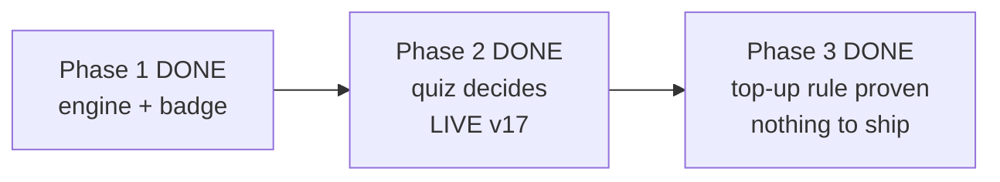

# STATUS — word-g1 (photograph of now, 2026-07-28)

THE RUN IS COMPLETE. All three slices are delivered: the nominating engine and badge
(phase 1), the quiz that decides nominations (phase 2, live at v17), and now phase 3 — the
weekly question top-up covers nominated words too, delivered as a small tested tool
(`scripts/quiz-topup.mjs`) instead of a sentence in a document.

Phase 3 shipped NOTHING to production, on purpose and by measurement: her live collection
(captured fresh: 20 words, 12 known, 0 nominated) already has a question for every word the
new rule covers — `missing=0`, nothing skipped, nothing banned. The app stays at v17; there
was nothing to deploy. The rule that keeps this true next week now runs as one command with
five tests behind it (suite 303/0, all other anchors unchanged: contrast 52, both frozen
screen-transcripts still match byte-for-byte).

Two things went wrong and were caught by the machinery, not by luck: a worker added an
uninvited fallback that would have silently treated a missing question folder as "no
questions needed" (the checker caught it; removed), and an edit invisibly rewrote a whole
document's line endings in a way git hides (a byte-level check caught it; redone cleanly).

A fresh backup of her collection exists at
`C:/Users/dkreinov/english-app-backups/profile-20260728-195804.json`. It is currently the
ONLY copy of her profile anywhere. Recommendation: KEEP it (nothing was deployed, but the
next run will want a starting net). Your call, as before.

WAITING ON YOU (nothing blocks): 1) keep or delete that backup; 2) "off-list" glossed words
still have no audio clip and no path to a quiz question — that deferred step has no owner or
date; 3) the weekly top-up is one command now, but nobody is scheduled to run it.
