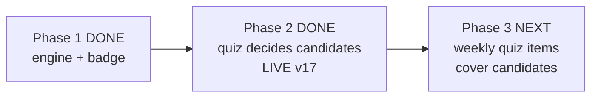

# STATUS — word-g1 (photograph of now, 2026-07-28)

PHASE 2 IS DONE AND LIVE (magic-vet-v17). The quiz can now DECIDE about an "almost known"
word: each practice round reserves its first question for one such word; a right answer makes
it properly known, a wrong answer sends it back to learning with a kinder message written for
a word she never claimed (עוד לא — נמשיך ללמוד את המילה הזאת) and restarts its promotion
clock so it cannot bounce straight back. Words she claimed herself keep their old rules to
the letter — proven by a screen-transcript that must match byte-for-byte, and it does.

Proof, not hope: all 298 tests pass (with and without the entry-code gate), colour contrast
unchanged (52), BOTH screen transcripts (old and the new hand-written one) diff empty, the
exact bytes we wrote are live on the server (all five changed files md5-proven), and her word
collection was read back after the deploy — 20 words, nothing lost, nothing changed.

She still has 0 "almost known" words — expected: the nominating engine first runs the next
time she generates a story chapter; the quiz slot correctly stays empty until then. Phase 3
closes the last gap: a nominated word with no quiz question can never pass, so the weekly
item top-ups must start covering candidates too.

The pre-deploy backup of her profile was DELETED at your instruction (given after the close
report). Said plainly: no copy of her collection exists anywhere until phase 3 takes its own
backup before its first deploy. Only the checksum record remains.

Rollback (code only, back to v16): `"$(npm prefix -g)/vercel" rollback
https://english-g80h5gnd9-dkreinovs-projects.vercel.app --yes`

Next: phase 3 — plan first with fresh eyes, then execute; recommended in a fresh session
(paste the handoff prompt from the briefing).
