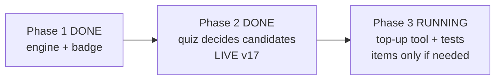

# STATUS — word-g1 (photograph of now, 2026-07-28)

PHASE 3 IS PLANNED AND STARTING (autonomous mode, per your handoff). The goal: the weekly
batch of new practice questions must stop covering only words she claimed and start covering
words the app nominated ("almost known") too — otherwise a nominated word with no question can
never be confirmed. The plan survived a fresh reviewer ("ship", one small wording rule fixed).

The plan's headline discovery: there is probably NOTHING to generate right now. All 12 words
she knows already have questions, and the app has nominated 0 words so far (it first runs when
she next makes a story chapter). So the lasting deliverable is the RULE itself as a small
tested tool (`scripts/quiz-topup.mjs`) that anyone can run next week — plus, only if her live
data demands it, new question files vetted by two blind checkers and approved by you before
anything ships.

Steps in flight: 3.1 the tool + 5 tests · 3.2 fix the one line in the growth document that
still teaches the old rule · 3.3 back up her live collection (no copy exists right now — this
comes before anything touches production) · 3.4 measure how many words need questions (likely
0; if 0 the phase closes there, no deploy) · 3.5-3.12 only if needed: write items, two blind
adversarial passes, your approval in the hint form, cache bump to v18, deploy, read-back.

Rollback (code only, back to v16): `"$(npm prefix -g)/vercel" rollback
https://english-g80h5gnd9-dkreinovs-projects.vercel.app --yes`

Questions waiting for you at the close (nothing blocks): keep or delete this phase's backup;
when the skipped "off-list" words get their audio + manifest entry; who runs the weekly top-up.
