# STATUS — word-g1 (photograph of now, 2026-07-28)

The app is live and healthy (magic-vet-v15). We are building G1: the app's first ability to
NOTICE by itself that she is learning a word. A word she looked up once, then met again in two
later chapters without looking it up, gets marked "almost knows it" (כמעט יודעת). That guess
never changes her stories — only a quiz pass (phase 2) or her own claim makes it count.

Phase 1 is executing (autonomous mode). Step 1.1 is DONE: the signed growth document is now
the document of record (docs/growth.md, byte-proven against the signed source; one stale
"awaiting signature" line in the source's tail was replaced by an honest "signed and copied"
note — logged, and the owner can overrule). Next: step 1.2, teaching the profile the new
"almost known" status.

```mermaid
flowchart LR
    A[1.1 growth.md<br/>becomes SIGNED] --> B[1.2 'candidate' legal<br/>+ merge trust rule]
    B --> C[1.3 the G1 rule<br/>promoteToCandidate]
    C --> D[1.4 runs on every<br/>new chapter]
    D --> E[1.5 badge כמעט יודעת<br/>+ claim button stays]
    E --> F[1.6 cache v16]
    F --> G[1.7 look at it<br/>in the sandbox]
    G --> H[1.8 BACK UP her<br/>live profile first]
    H --> I[1.9 deploy + prove<br/>bytes live]
    I --> J[1.10 read her data<br/>back: nothing lost]
```

Key numbers: tests 282/0 today → 291/0 when phase 1 closes · contrast anchor stays 52 ·
cache v15 → v16 · her live profile: backed up to C:/Users/dkreinov/english-app-backups/
before the deploy (step 1.8), read back and proven intact after (step 1.10).

One question waits for the owner (asked at step 1.8): should the profile backup be DELETED
when the phase closes, as last time (D27)? Until answered, we keep it — the safe direction.

Rollback (code only): `"$(npm prefix -g)/vercel" rollback
https://english-d0roovfpq-dkreinovs-projects.vercel.app --yes` → v15 dpl_HUjmYpAvumkWDXxsjkZiQzY7GRTn.

Phase 2 (sketch): candidates enter the quiz — one per session, one wrong answer returns it to
learning, with a kinder message. Phase 3 (sketch): weekly quiz-item top-ups cover candidates.
