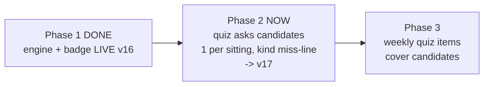

# STATUS — word-g1 (photograph of now, 2026-07-28)

PHASE 2 IS PLANNED AND EXECUTION HAS STARTED. Phase 1 (live at magic-vet-v16) taught the app
to notice by itself that she is learning a word — the "almost knows it" (כמעט יודעת) badge.
Phase 2 makes that guess RESOLVE: the practice quiz will ask about one "almost known" word per
sitting; one wrong answer sends it back to learning with a kinder message written for a word
she never claimed (עוד לא — נמשיך ללמוד את המילה הזאת), and its promotion clock restarts so it
cannot bounce straight back; one right answer makes it properly known.

The plan (11 steps, 12 mechanical acceptance checks) was written by a fresh planner from the
files alone, fact-checked by me against the code line by line (one internal contradiction
found and fixed before any work started), and then independently reviewed: ship, zero findings.

Order of work: first I write down BY HAND what the new quiz screen must say (before any code
exists, so the check cannot be circular); then four helper steps change the code; one fresh
helper tries to break it end to end; then the cache version bumps to v17; I look at it in the
sandbox with my own eyes; her live data is backed up; we ship; and her data is read back and
proven intact.

She currently has 0 "almost known" words (measured at the phase-1 close) — the engine first
runs at her next chapter, so this phase may ship a working quiz path that simply waits.

NO backup of her profile exists right now (the phase-1 backup was deleted at your instruction).
Nothing touches production before the new backup at step 2.9.

Rollback (code only, back to v16): the url is taken from `vercel inspect` at deploy time for
dpl_9yj3HbhU7p5ZNAGQHUeTCvM2D3Dc — never constructed by hand (that bit us once).

OPEN QUESTIONS FOR THE OWNER: none right now. At the close you will be asked one: delete or
keep the new backup (your earlier "delete it now" was about the phase-1 file; I do not assume
it was a standing order).
