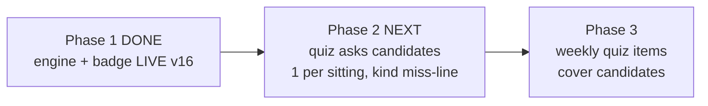

# STATUS — word-g1 (photograph of now, 2026-07-28)

PHASE 1 IS DONE AND LIVE. The app (magic-vet-v16) can now notice, by itself, that she is
learning a word: a word she looked up once and then met in two later chapters without looking
it up gets the new badge "almost knows it" (כמעט יודעת), and her "I know this" button still
works on those words. The app's guess never changes her stories — only her claim or (next
phase) a quiz pass does.

Proof, not hope: all 291 tests pass (with and without the entry-code gate), colour contrast
unchanged (52), the exact bytes we wrote are what the server serves, and her word collection
was read back from production after the deploy — 20 words, nothing lost, nothing changed
unexpectedly. Her data was backed up before the deploy and the backup is KEPT (see the one
open question below).

Right now she has 0 "almost knows it" words — expected: the engine first runs the next time
she generates a story chapter. Her phone gets the new screen on its second open (the shell
self-updates).

ONE QUESTION FOR THE OWNER: last run you asked that profile backups be deleted at close (D27).
Apply that again and delete C:/Users/dkreinov/english-app-backups/profile-20260728-135019.json,
or keep it? It is kept until you say.

Rollback (code only): `"$(npm prefix -g)/vercel" rollback
https://english-2wkxdnp9g-dkreinovs-projects.vercel.app --yes` (back to v15).

Next: phase 2 — plan first with fresh eyes, then execute; recommended in a fresh session
(paste the handoff prompt from the briefing).
