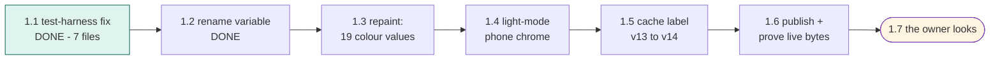

# STATUS — word-quiz-reskin (photograph of now, 2026-07-28)

The quiz app is live and healthy. This run repaints it in the owner-chosen "Sunrise Parchment"
look (warm paper, cocoa ink, violet + amber) and clears two old code warts. One publish at the
end, then the owner looks.

**Where we are: steps 1.1 and 1.2 of 7 are done and saved.** The test-harness fix landed — and
it turned out the old checklist had missed a seventh file with the same bug; the helper spotted
it and stopped to ask, the manager ruled it in. All 282 tests now pass even on a machine with
the app's secret entry code switched on (before: 48 quietly failed there). The trap variable is
renamed. Both steps were double-checked by fresh-eyed checkers: match. Next: the repaint itself.

Safety rails: rollback command recorded; the new palette already proven readable (52/52); her
saved words untouched by this run.

Nothing is blocked. Nothing is needed from you until step 1.7 (the look).
