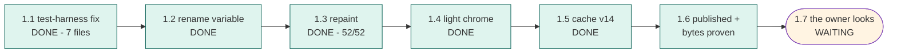

# STATUS — word-quiz-reskin (photograph of now, 2026-07-28)

**The new look is LIVE.** The app now wears "Sunrise Parchment": warm paper background, cocoa
ink, deep violet and amber — the palette the owner chose. Both code warts are gone. All 282
tests pass (now also on machines with the secret entry code switched on — 48 used to fail
there), all 52 readability pairs pass, and the published files were proven byte-for-byte
identical to what we built. Her saved words were never touched.

**The one thing left: the owner looks (step 1.7).** Ask her to open the app on her phone — if it
still looks brown, force a reload (phones keep the old copy until the new v14 label kicks in) —
and to say what she thinks of five specific spots that deliberately kept their old styling:
1. the shadow under the bottom bar (still tuned for a dark page);
2. how the pictures fade into the page at their bottom edge (now a cream bleed, not night);
3. the app icon (still a dark badge — it will stand out on a light home screen);
4. does the plain cream look too flat (we left out the optional paper texture);
5. the cards "lift" more softly now.
Each is a one-line follow-up if she wants it changed. Her exact words go in the journal.

If anything is actually broken: one recorded command rolls the site back to the previous version.

Nothing else is blocked. Nothing else is needed.
