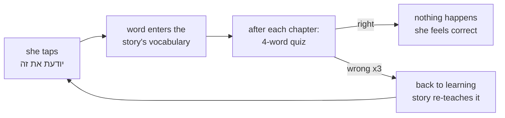

# STATUS — word-quiz (W5b)

**Where we are:** planning is finished and reviewed. No code has been written yet.

## What this run builds

Mika can already tap "יודעת את זה" to claim she knows a word. Nothing checks that claim — and the
claim is not just a badge: it feeds the word into the story generator's vocabulary, so a wrong claim
quietly makes her chapters harder. This run builds the check.

She gets a short quiz after each chapter: a sentence with one word missing, six options she can read
or hear, drawn from the words she has claimed. Get it wrong three separate times and the word goes
back to "learning" so the story teaches it again.

## Progress

| Phase | What | State |
|---|---|---|
| Planning | design + plan + 3 review rounds | **done** |
| 1 | item format, the checker, 50-word pilot | next |
| 2 | the full bank, 2254 words | not started |
| 3 | profile: strikes and demotion | not started |
| 4 | the quiz screens | not started |
| 5 | automatic promotion (G1) | not started |
| 6 | deploy | not started |

## What it costs

**No money.** The sentences are written by Claude here, not by a paid API, and there is no
live AI call in the app. DeepSeek and Kimi were priced as alternatives and turned out not to be
needed.

## The one thing that needs you

Phase 1 ends with **you reading 50 real quiz items** and saying yes or no. This is not a formality.
The automatic checks can prove a sentence only uses words she knows — they cannot prove the sentence
makes sense, or that the six options really have only one right answer. This project has already
shipped two things that passed every automatic check and were still wrong. A person has to look.

Also expect one question: the word list contains **gay**, and how to write a sentence for a
nine-year-old with that word is your call, not a worker's.
