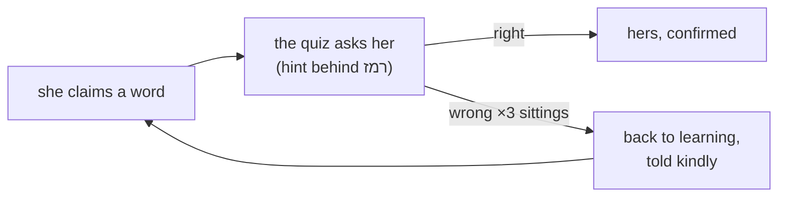

# STATUS — word-quiz (W5b)

**THE RUN IS COMPLETE. The quiz is live, you have seen it working, and Mika's data came through
untouched.** The backups were deleted at the close, as you asked — after her live profile was
read back and proven intact (all 20 words, nothing changed).

## What this run delivered

She claims a word → within a chapter or two the app asks her about it — sentence first, meaning
behind a רמז button (your choice), six options she can hear. Right answers build confidence;
wrong on three separate sittings sends the word kindly back to learning and the story re-teaches
it. Every word she has claimed has an approved question; two independent reviewers plus you
checked every one.

## What is staged next (nothing running; your word starts any of them)

| Work | State |
|---|---|
| **Sunrise Parchment re-skin (your D29)** | scoped and ready — token swaps, one test file, re-prove contrast, deploy |
| 4 small code chores | evidence-backed packets ready (biggest: 48 tests fail today if the access code is exported in a shell) |
| Automatic promotion (G1) | signable design draft ready — read `night/growth-amended-DRAFT.md` |
| Second profile for your tests | design ready — recommends a separate deployment (structurally can't touch her data) |
| Parent view | design ready — built on data that already records |
| Weekly top-up | due whenever she claims new words |

## Honest notes

- The demotion message has never been seen on a real screen (it needs three separate bad
  sittings) — its evidence remains the hand-derived transcript you approved.
- Your local sandbox (safe play, her exact flow) restarts with:
  `DATA_DIR='C:\Users\dkreinov\english-app-sandbox' npm run dev`
- No backups exist anymore; the next deploy that touches profile fields should take a fresh one.

## What it cost

No money — no paid API anywhere. Agent work across the whole run: roughly 4.6M tokens of
helpers/checkers/planners (phase 6 + its night shift alone: ~1.9M), all logged per step in the
journal.
