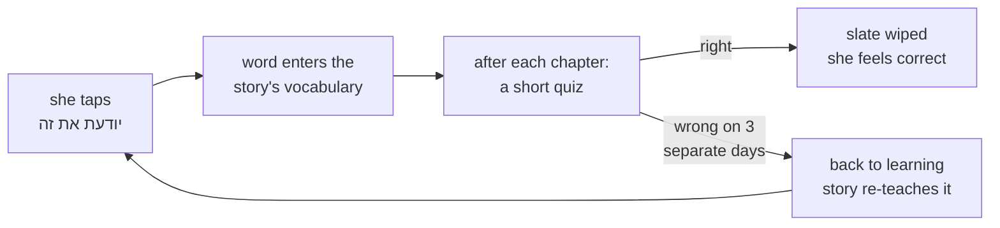

# STATUS — word-quiz (W5b)

**Where we are:** phase 3 is built and every automatic check passes. **It is waiting on you** — one
question, below. Nothing Mika can see has changed, and nothing is deployed.

## What this run builds

Mika can already tap "יודעת את זה" to claim she knows a word. Nothing checks that claim — and the
claim is not just a badge: it feeds the word into the story generator's vocabulary, so a wrong claim
quietly makes her chapters harder. This run builds the check.

She gets a short quiz after each chapter: a sentence with one word missing plus its meaning, six
options she can read or hear, drawn from the words she has claimed. Get it wrong on three separate
days and the word goes back to "learning" so the story teaches it again.

## Progress

| Phase | What | State |
|---|---|---|
| Planning | design + plan + 3 review rounds | done |
| 1 | item format, the checker, 50-word pilot | done — you approved it |
| 2 | the full bank | cancelled as a phase — the bank now grows weekly, on demand |
| 3 | profile: strikes and demotion | **built; waiting on your answer** |
| 4 | the quiz screens | not started |
| 5 | automatic promotion | not started |
| 6 | deploy | not started |

## The one thing that needs you

Read the transcript I printed for you and answer one question: **is this what you want her week to
feel like?**

It is a real run of the real code over one imagined week. What it shows:

- She taps **light** twice to hear it. That costs her nothing — it just flags the word as worth
  re-asking.
- On day 1 she gets **light** wrong **three times in a row**. That costs her **one** strike, not
  three. A bad two minutes is one bad moment, not three failures.
- On day 3 she gets it **right**, and the slate is wiped completely — back to zero.
- Only after three separate bad days does **light** go back to "learning".
- **method** sits at one strike. **fair** is untouched. She still has both.

If you would rather it were two strikes, or four, or that a right answer only removed one strike
instead of all of them — say so now. It is a small change now and a much bigger one after the
screens are built on top of it.

## What I could not check, and you should know it

- **Her real saved profile.** It lives in Vercel storage and cannot be read from here, so backward
  compatibility was proved against a reconstructed copy, not her actual file. Phase 6 takes a
  backup before deploying anything. This was a deliberate call you made earlier.
- **Whether the demotion is visible to her.** That is phase 4's job, and phase 4 is not built.

## What it costs

**No money.** The sentences are written by Claude here, not by a paid API, and there is no live AI
call in the app.
