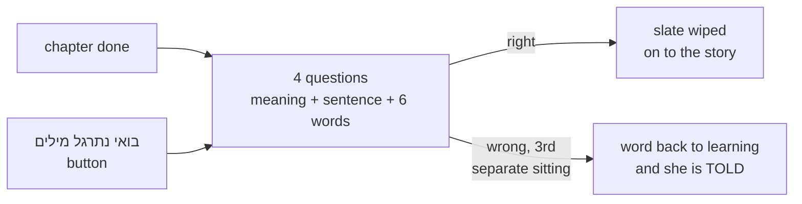

# STATUS — word-quiz (W5b)

**Where we are:** phase 4 — the quiz screens — is **done and approved by you.** All eleven
checks green. Now planning phase 5 (automatic promotion). Nothing is deployed yet; her app
changes only at phase 6.

## What got built this phase

Mika now gets asked. After every chapter she answers four quick questions — the word's meaning on
top, a sentence with a gap, six words she can read or hear. There is also a "בואי נתרגל מילים"
button in המילים שלי. Get a word wrong on three separate sittings and it goes back to
"learning" — and a kind line TELLS her so. Nothing is deployed yet; her app is unchanged until
phase 6.

## Progress

| Phase | What | State |
|---|---|---|
| 1 | item format, checker, 50-word pilot | done — you approved it |
| 2 | the bank | grows weekly on demand; FIRST top-up is now a phase-6 requirement |
| 3 | profile: strikes and demotion | done — you approved the transcript |
| 4 | the quiz screens | done — you approved the screens |
| 5 | automatic promotion | **being planned now** |
| 6 | deploy (backup + first top-up + your first real look) | not started |

## What the checking machinery caught this phase (all fixed before anything shipped)

- The plan itself: the after-chapter quiz would have run once and then never again (chapter 2
  onward) — caught by the plan reviewer before any code existed.
- An invisible blank line quietly added to the words page — caught by a checker, rejected, fixed.
- A test that would have stayed green while the app showed the "word taken back" message on every
  wrong answer — caught by a checker; the test now proves the message stays silent until the
  real third strike.
- Eight deliberate sabotage runs against the finished code: every one was caught by a test. An
  independent helper who never saw the code being written could not make it misbehave.

## What needs you

Nothing right now. You approved the screens and chose to keep the planned order (promotion, then
deploy). The next thing you will see is the phase-5 plan in plain words.

## Honest limits

- No screen has rendered in a real browser this whole run — the tests check the text and
  structure, not the look. Your first look at the deployed app is the real look.
- Until the first bank top-up runs, the quiz only knows the 50 pilot words.

## What it costs

**No money.** No paid API, no live AI call in the app.
