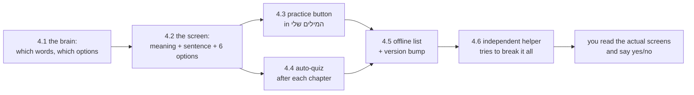

# STATUS — word-quiz (W5b)

**Where we are:** phase 4 — the quiz screens, the part Mika actually sees — is **planned in full,
reviewed, and now being built**. Phases 1 and 3 are done and approved by you. Nothing is deployed;
nothing she can see has changed yet.

## What this run builds

Mika can already tap "יודעת את זה" to claim she knows a word. Nothing checks that claim — and the
claim feeds the word into the story generator's vocabulary, so a wrong claim quietly makes her
chapters harder. This run builds the check: a short quiz after each chapter — the word's meaning,
a sentence with a gap, six options she can read or hear. Wrong on three separate days → the word
goes back to "learning" and the story re-teaches it, and now she is TOLD when that happens.

## Progress

| Phase | What | State |
|---|---|---|
| 1 | item format, checker, 50-word pilot | done — you approved it |
| 2 | the full bank | not a phase — the bank grows weekly on demand |
| 3 | profile: strikes and demotion | done — you approved the transcript |
| 4 | the quiz screens | **building now — 1 of 6 steps done** (4.1 the brain: accepted) |
| 5 | automatic promotion | not started |
| 6 | deploy (+ first bank top-up, + profile backup) | not started |

## What the plan review caught before any code was written

A fresh reviewer found one real bug in the plan itself: the after-chapter quiz would have run for
chapter 1 and then **silently never again** — the "quiz finished" switch was never flipped back
for the next chapter. Fixed in the plan, with a test that pins it. This is exactly the kind of
failure where every automatic check stays green, which is why the plan gets attacked before work.

## The three promises phase 4 must keep (decided before building)

- **Each sitting is a genuinely new sitting.** Otherwise no word can ever collect its three
  strikes, and the whole correction loop silently never fires. A separate helper who never saw the
  code will try to break exactly this.
- **A claimed word with no quiz question yet is skipped in silence** — she is never blocked.
- **A demotion is visible**: a kind line tells her the word is going back to learning.

## What needs you

Nothing yet. At the end of phase 4 you will be shown the three actual screens — question, wrong
answer, and the "word taken back" message — and the phase does not close until you approve them.

## What it costs

**No money.** No paid API, no live AI call in the app.
