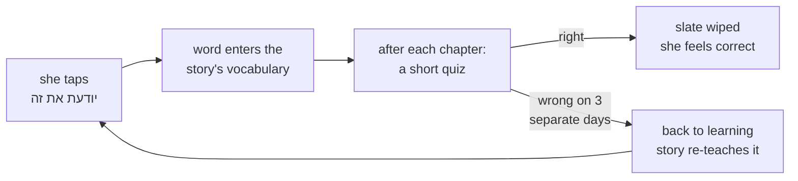

# STATUS — word-quiz (W5b)

**Where we are:** phase 1 is closed and approved by you. Phase 3 is being built now — step 3.1 of 5
is done. **Nothing Mika can see has changed yet, and nothing is deployed.**

## What this run builds

Mika can already tap "יודעת את זה" to claim she knows a word. Nothing checks that claim — and the
claim is not just a badge: it feeds the word into the story generator's vocabulary, so a wrong claim
quietly makes her chapters harder. This run builds the check.

She gets a short quiz after each chapter: a sentence with one word missing plus its meaning, six
options she can read or hear, drawn from the words she has claimed. Get it wrong on three separate
days and the word goes back to "learning" so the story teaches it again.

Three wrong taps in ONE sitting cost her one strike, not the word. That rule is the single thing
phase 3 exists to get right.

## Progress

| Phase | What | State |
|---|---|---|
| Planning | design + plan + 3 review rounds | done |
| 1 | item format, the checker, 50-word pilot | **done — you approved it** |
| 2 | the full bank | **cancelled as a phase** — the bank now grows weekly, on demand |
| 3 | profile: strikes and demotion | **in progress — 1 of 5 steps done** |
| 4 | the quiz screens | not started |
| 5 | automatic promotion | not started |
| 6 | deploy | not started |

## What it costs

**No money.** The sentences are written by Claude here, not by a paid API, and there is no live AI
call in the app. Building all 2217 words up front was measured at roughly 45 agent-hours, so that
was dropped: words get quiz items as she claims them, in a weekly batch.

## The one thing that needs you

Phase 3 ends with **a printed transcript of one imaginary week of Mika's answers**, and one question
from me: *is this what you want her week to feel like?* Three strikes, one strike per sitting, one
right answer wipes the slate — those are policy choices, and no test can tell you they are the right
ones for your daughter.

It is not a formality. Phase 1 closed once on my written assurance, an audit then found the
assurance was false, and the whole phase had to be re-opened. So this time you get the machine's
literal output, not my summary of it.

## Risks I am watching

- **A wrongful demotion** — she is right and the app takes the word away. Guarded three ways.
- **Her saved profile is the one file holding everything she has collected.** Phase 3 only ever
  adds optional fields and never rewrites old ones. Phase 6 takes a backup before deploying.
