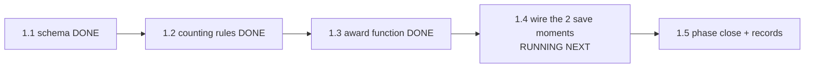

# STATUS — word-trophies (photograph of now, 2026-07-29)

PHASE 1 IS RUNNING. You said GO; the run is in autonomous mode inside phase 1 and will pause
when the phase closes. Steps 1.1-1.3 of 5 are done and saved: her profile format now has a
"trophies" box (empty by default), with rules that reject malformed trophy data and accept
future trophies an older app version has never heard of. The test that would catch every
planted bug was watched failing and passing — all on the first try.

Nothing she can see has changed and nothing was deployed: production stays at v17, her live
profile untouched, the app's pages byte-identical. The suite grew 303 -> 323 tests, all
green, on the way to 328 by the end of the phase.

WAITING ON YOU: nothing right now. The next stop is the phase-1 close report.
