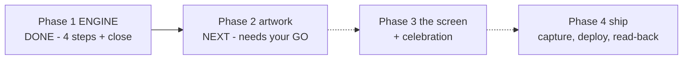

# STATUS — word-trophies (photograph of now, 2026-07-29)

PHASE 1 IS DONE. The trophy engine is fully built, tested, and saved — and it is invisible
by design: nothing she can see has changed, nothing was deployed, her live profile was
never touched or read. Production still runs v17.

What her profile can now do (once a later phase ships it): carry a trophies box; count the
8 signed achievements exactly as you approved them; stamp a date on any newly earned
bronze/silver/gold at the two moments the server already saves her profile — and never
un-stamp, rewrite, or invent one. Every rule was proven by breaking the code on purpose
(15 planted bugs across the phase, each caught by exactly the test that guards it).

The suite grew 303 -> 328 tests, all green. One plan defect was caught mid-run by a helper
who stopped and asked instead of guessing (the plan's own "break it on purpose" check was
impossible as written) — fixed as a written amendment, exactly how the machinery is meant
to work.

WAITING ON YOU: say GO to plan phase 2 (the 9 trophy artworks via ChatGPT web, each needing
your approval) — or tell me to pause here. Recommended: /clear first and resume with the
handoff prompt in the phase report; this session's memory is heavily used.
