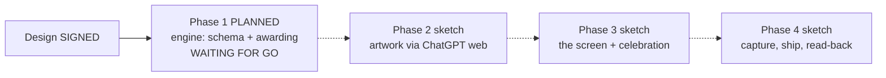

# STATUS — word-trophies (photograph of now, 2026-07-29)

THE RUN IS PLANNED AND WAITING FOR YOUR GO. The design is signed (8 trophies, Hebrew names
per the audit, stored in her profile, awarded only at the two moments the server already
saves it, artwork in the app's style generated via ChatGPT web with your per-image approval).
Phase 1 — the invisible engine — is planned in full (5 steps), survived a hostile review
(2 amendment rounds: wrong line-count pins that would have failed correct work, and commit
commands that could not run), and is frozen.

Phase 1 changes nothing she can see and deploys nothing: it teaches the profile to carry
trophies, writes the 8 counting rules exactly as signed, adds the award function (never
removes, never rewrites, never invents), wires it at the two save moments, and grows the
test suite 303 -> 328 with a watched failure for every rule. Production stays at v17; her
live profile is not touched or read.

One design correction already earned: the signed wording put the chapter-time award BEFORE
the new chapter is counted — measured, it would miss every chapter milestone at the moment
it happens; the plan fixes the position and records it as an amendment (SK-1).

WAITING ON YOU: say GO to start phase 1 — and whether this run may proceed phase-to-phase
autonomously (like word-g1) or should pause for your go at each phase boundary.
