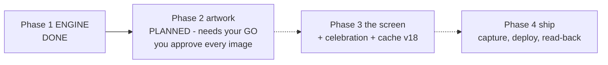

# STATUS — word-trophies (photograph of now, 2026-07-29)

PHASE 2 (the artwork) IS PLANNED AND WAITING FOR YOUR GO. Phase 1's engine is done and
committed; nothing visible or deployed has changed; her live profile has never been touched.
Production still runs v17.

The phase-2 plan, in one breath: nine picture requests are written down word-for-word in the
plan (eight trophies + one shelf header, all objects from her app's world — no people, no
metal cups, because the app's own colors mark bronze/silver/gold). I generate them one at a
time in the SAME ChatGPT chat that drew every existing picture, you say yes or no to each
one, a tiny script shrinks the approved nine for the web, and the design document records
everything so a tenth trophy can be made months from now without asking anyone.

Checked today before planning: all 328 tests green, color check 52, production untouched,
no local copy of her profile, no backup capture yet (correct — phase 4 makes one).

One decision folded into your GO: this phase does NOT touch the phone's cache version.
The new images are never pre-cached, nothing deploys until phase 4, and the signed design
puts the one cache bump in phase 3 — so bumping now would be needless. Saying GO ratifies
that; say otherwise and the plan has the exact fallback written in.

WAITING ON YOU: say GO to start phase 2 — or ask anything about the plan first.
