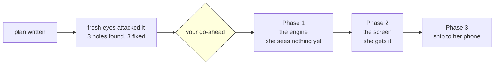

# STATUS — word-write (photograph of now, 2026-08-03)

**Nothing has been built yet.** The plan is written, a second pair of eyes has attacked it, the
three holes it found are fixed, and the run is waiting for your go-ahead.

## What this run gives her

She asked to **write** words, not only pick them from a list. Right now every quiz question in
the app is the same shape: a sentence with a gap and six buttons. After this run there are four
shapes, and she gets one of each in every sitting of four.

| # | what she sees | what she does |
|---|---|---|
| 1 | a sentence with a gap | taps the right word (this is today's question, unchanged) |
| 2 | the Hebrew word | taps the English one |
| 3 | the Hebrew word | **types the English word** |
| 4 | a speaker button, no text | **listens, then types the word** |

Plus two things she complained about, both fixed:

- **The phone must stop writing the answer for her.** The typing box turns off autocomplete,
  autocorrect, autocapitalise and spellcheck.
- **"I get the same exact questions."** Today one word she once got wrong is question #1 in
  literally every quiz until she gets it right. That is fixed too.

## What I measured before planning any of it

I read her real profile twice (both copies deleted, receipts kept, no word of hers written down):

- **46 words. Every single one already has a Hebrew translation and a recorded sound.** So all
  four question shapes can be built today with no new content, no recordings and no money spent.
- Her words are 3 to 6 letters long. Typing them is a fair ask.
- The app has never measured her writing at all — that field in her profile literally reads
  `unknown`.

## Three mistakes caught before any code was written

1. I read her profile file at the wrong level and told myself she had **zero** words. The file was
   30 kilobytes. A zero that big should have stopped me on the spot.
2. I checked her words against the sound list the wrong way and concluded **none** of her words
   had a recording. All of them do.
3. My own safety check was broken: it demanded a file stay exactly 99 lines long, in a phase whose
   every step **adds** lines. It would have failed all four steps.

None of these reached any code. They are written down because two of the three were me trusting
what I assumed a file looked like instead of looking.

## The one thing I will not be able to prove

I cannot drive her actual phone keyboard from this machine. I can set every correct setting and
check it at phone size in a desktop browser — but whether *her* phone really stops suggesting
words is something only she can confirm. You will get this stated plainly again at the end, not
buried.

## Where we are

Live right now is the previous run's deploy, `magic-vet-v24`. Nothing has changed on her phone.
