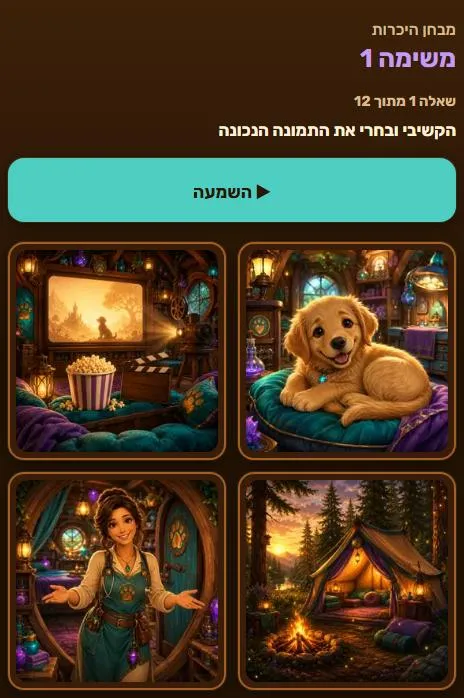

# מרפאת הקסמים — The Magic Clinic

A personal English-learning PWA built for one Hebrew-speaking 11-year-old.

A placement test works out which English words she actually knows. From there the app generates a
serialized story — a girl apprenticed to a veterinarian for magical creatures — deliberately
constrained to ~95–98% words already in her vocabulary, so she can read it without drowning in a
dictionary. Tapping any word gives the Hebrew translation and adds it to her collection.

<table>
  <tr>
    <td width="45%"></td>
    <td width="55%"></td>
  </tr>
  <tr>
    <td align="center"><em>Home</em></td>
    <td align="center"><em>Placement: hear a word, pick the picture</em></td>
  </tr>
</table>

## How it works

1. **Placement** — twelve vocabulary items (hear a word → pick the picture, or see a picture →
   pick the word) plus two short reading passages with comprehension questions. This produces a
   band, which sets the difficulty of everything after it.
2. **Story** — chapters are generated against that band, with a hard constraint on unknown-word
   density, so the text stays just past the edge of what she knows.
3. **Words** — every word she taps is translated, saved, and tracked as *learning* or *known*.

## The artwork

Every illustration is generated in one consistent style — a warm wood-and-magic veterinary clinic
world — and the whole interface is themed from colours sampled out of the art itself, so the app
and its pictures look like one place rather than pictures pasted onto a page.


The placement answers used to be emoji, which failed badly for abstract words: a spiral was
supposed to mean *fan*, a person at a laptop meant *desk*, and a lion meant *zoo*. They are
illustrations now.

## Design notes

- **Hebrew-first, RTL throughout.** The interface language is Hebrew; the learning content is English.
- **Accessibility is enforced, not assumed.** `scripts/check-contrast.mjs` mechanically checks 52
  text/background pairs against WCAG AA and fails the build if any pair drops below threshold.
- **Offline-capable PWA** with a precached shell and a versioned service-worker cache.
- **No build step.** Plain ES modules served straight to the browser.

## Stack

Vanilla JS ES modules · Node serverless functions on Vercel · Vercel Blob for the learner profile ·
OpenAI for chapter generation and translation · `sharp` for image optimisation · `node:test` for tests.

## Running it

```bash
npm install
npm run dev      # http://localhost:3000  (override with PORT)
npm test         # 157 tests, node:test, no framework
```

Optimise generated artwork into web derivatives:

```bash
node scripts/optimize-assets.js      # story/scene art
node scripts/optimize-placement.js   # placement answer art
```

## Configuration

Copy `.env.example` to `.env` and fill in:

| Variable | Purpose |
|---|---|
| `OPENAI_API_KEY` | chapter generation and translation |
| `BLOB_READ_WRITE_TOKEN` | Vercel Blob storage for the learner profile (falls back to a local file when unset) |
| `APP_CODE` | shared entry code guarding the API — see below |
| `DATA_DIR` | where the local profile file lives (defaults to `.data`) |

### The entry code

The API sits behind a short shared code supplied in `APP_CODE`. The client asks for it once and
remembers it on the device. It exists to keep crawlers and passers-by away from a single child's
learning data and from the endpoints that spend OpenAI credit — it is **not** meant to withstand a
determined attacker, since a short numeric code is brute-forceable.

If `APP_CODE` is unset the gate is open. That keeps local development and the test suite working
without configuration, and means a missing production variable degrades to unprotected rather than
locking the learner out of her own app.

## Repository layout

```
api/         serverless endpoints (profile, placement, chapter, translate, health)
lib/         shared logic — placement scoring, story generation, storage, auth
public/      the app itself: views, styles, service worker, optimised assets
assets/      full-resolution artwork masters
data/        the item bank and the band 1 + band 2 vocabulary lists
docs/        visual design system (frozen) + screenshots
scripts/     dev server, asset optimisation, accessibility gate
tests/       node:test suites
.oplan/      planning and decision records for each major change
```

## Status

Live and in daily use by its one intended user.
